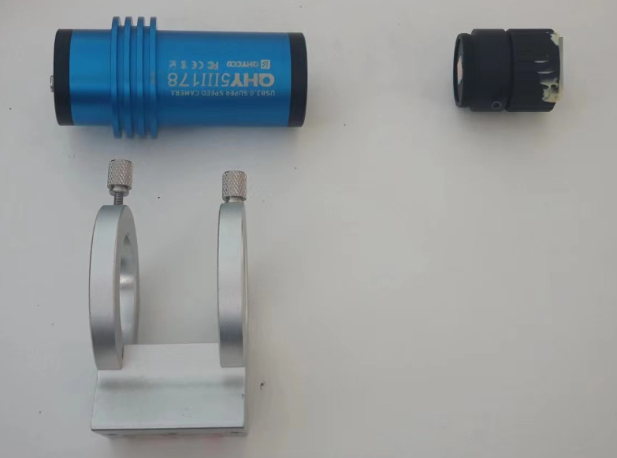
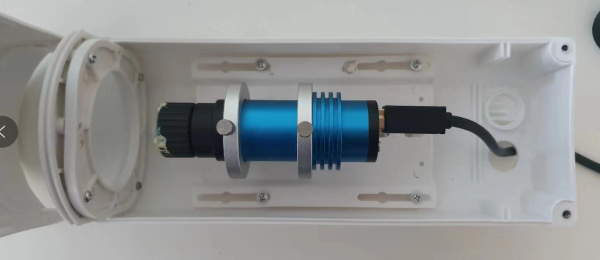
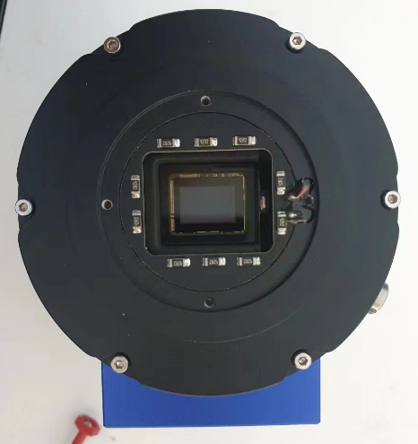
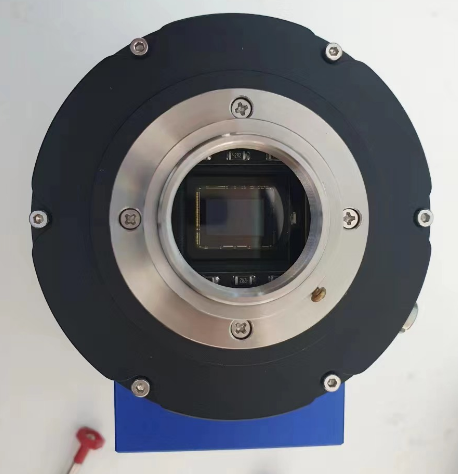
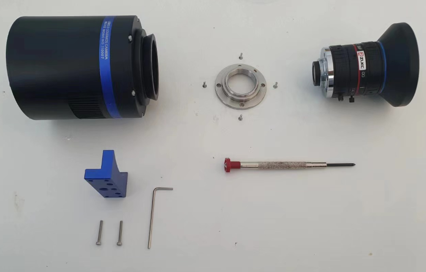
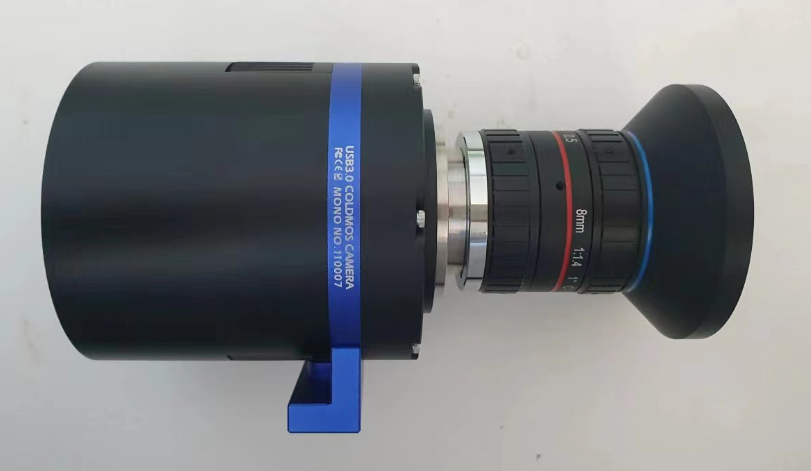
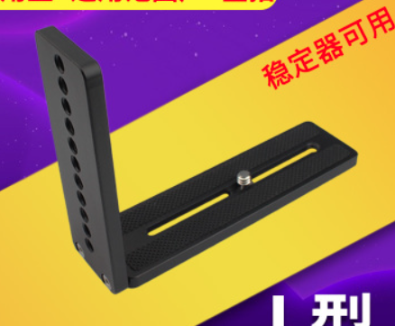
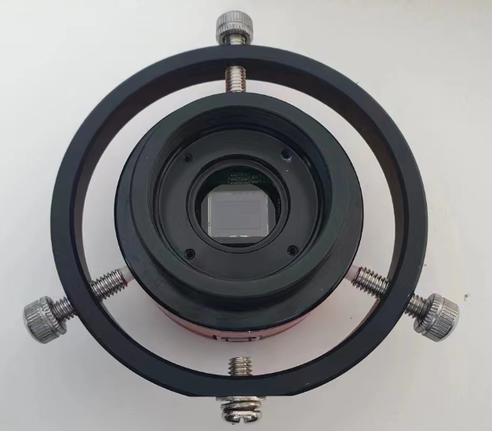
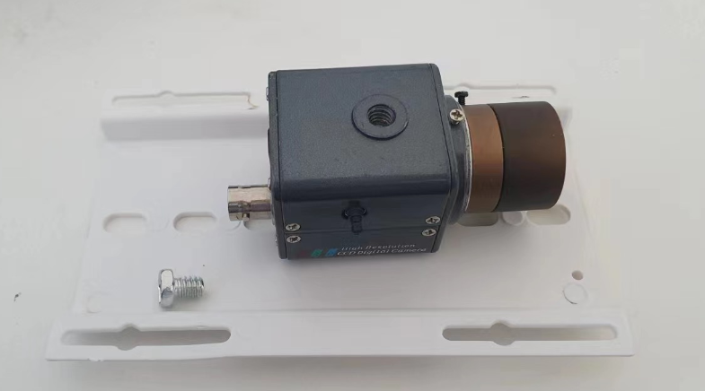

# 相机部分

相机部分其实就一个关注点：防水。主要的工作量就是把相机装在防水壳里，再把防水壳固定在支架上。成品的网络摄像头是最简单的，但是天文相机需要自己组装。

现在市面上的监控产品，无论是相机与防水壳，还是防水壳与支架的安装，主要都采用英制的 1/4 螺丝。防水壳中配一个底板，将相机安装在这个底板上，再把底板安装在防水壳里，就完成了。1/4 螺丝其实就是摄影三脚架用的螺丝，所以监控防水壳可以很方便地装在三脚架上，如果你愿意，也可以把海康威视的摄像头装在星野赤道仪上，虽然没有这个必要。

使用 QHY 或 ZWO 等品牌的天文相机时需要自行组装。除了相机之外，还需要单独购买镜头。其实最适合的镜头也是来自于安防行业，它们价格便宜，使用的是 CS 接口，各项参数与天文相机也是适配的。关于如何选择最合适的镜头，请看[这篇文章](../meteor/camera.md)。

## QHY

QHYCCD 的相机在外形上主要分两种，形状与目镜相似的非制冷相机和比较粗大的制冷相机。两者都可以安装 CS 接口的镜头。

1.25 寸直径的非制冷相机自带 CS 接口的螺纹，所以市售的监控镜头可以直接安装在上面。将圆形的相机安装在防水壳中，需要一个导星镜抱箍。

  

而制冷相机安装镜头，需要一个特殊的配件，在购买时需要向卖家索要。拆下相机前的两寸接口，再装上对应接环，就可以安装 CS 接口的镜头了。防水壳方面，近期出货的 QHY 制冷相机会附带一个“热承”，可以安装在相机的底部，提供一个 1/4 螺丝孔。有了这个配件，就很方便将相机安装在防水壳里了。

|                               |                               |
| ----------------------------- | ----------------------------- |
|  |  |

对生产日期较早的相机来说，可以选择用六点式导星镜抱箍固定相机，或者直接用热熔胶将相机粘在底板上（不推荐）。总体来说，制冷式相机由于外形比较大，需要更大的防水壳。

  

## ZWO

ZWO 相机大同小异，也需要对应的零件来适配监控镜头的 CS 接口。值得注意的是，ZWO 的非制冷相机形状是圆饼形，1/4 螺丝孔在背面而不是底部，需要一个 L 形快装板转接，或者同样使用三点式或六点式抱箍。

|                               |                               |
| ----------------------------- | ----------------------------- |
|  |  |

另外，相机的 USB 接口位于相机侧面，这个位置也会影响到相机的安装，因此需要选购折角的 USB 线，买的时候注意折角的方向。下弯的 USB3.0 线很难找到，所以退而求其次选择左弯或右弯的。

这两个因素都会导致组装好的相机整体直径很大，因此有必要准备足够大的防水罩。

## 监控相机

监控相机的安装是最简便的。摄像头基本都自带 1/4 螺丝孔位和 CS 镜头接口，对应组装在一起就好。如果是一体式的室外摄像头，则组装镜头这一步也可以省略了，直接将相机安装在支架上即可。

