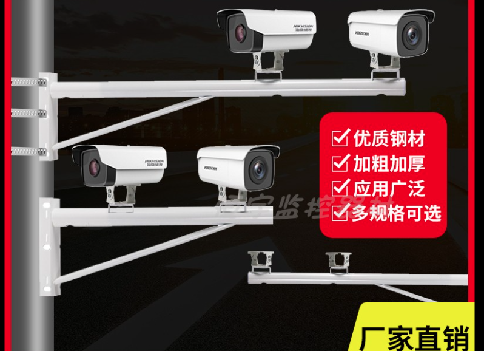
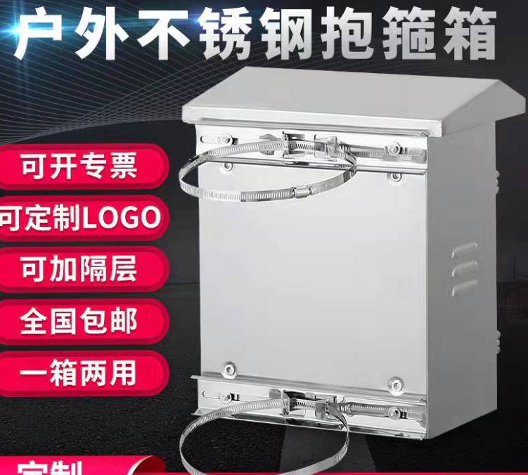

# 支架和安装

将各个部分组装起来需要因地制宜。我设计的流星监测装置会尽力减少对现场环境的依赖，只需要电源、空地，这样可以适用于最多的场景。不过如果你想安装的地点已经有一些基础设施，那么利用现有资源也是很好的选择。根据涉及到的零件，可以选择其中一个“风格”来搭建。

## 监控风格

在网上还是可以找到各种监控用的配件。如果想要安装在电线杆上，可以选用抱箍固定监控支臂，上面再安装相机防水罩；如果想安装在墙上，可以用膨胀螺栓。安装电脑的防水箱也同理。

还有个小问题：市售的监控支架（“鸭嘴”）是为了平视设计的，一般不能调节到 45° 以上的仰角。为了可以把相机指向天空，可以尝试串联两个这样的支架来获得更高的自由度。也可以让提供定做的卖家将安装座旋转 90 度变成侧面安装，这样相机初始位置就可以指向天顶。

|                               |                               |
| ----------------------------- | ----------------------------- |
|  |  |

## 摄影风格

之前也说了，相机防水壳大多数有 1/4 螺丝孔，可以与摄影三脚架适配。如果有闲置的三脚架，或者现场没有现成的支架，可以采用这种安装方式。相机三脚架基本可以指向任意方向，因此没有上面提到的问题。电脑的防水箱可以用铁丝或小号的抱箍捆绑在三脚架的一条腿上。同时，为了防止三脚架被大风吹翻，需要在底部固定一些重物。

有了以上的各种零件，一套流星监控设备就可以搭建起来了。安装过程可能不是一帆风顺，在运行过程中，也许也还有种种小问题需要我们去优化。这也是搭建过程的趣味所在。一套设备最开始可能每天晚上都需要照顾，而成熟后可以自动连续运行几个星期，我们每天醒来都可以看到新的流星视频入账。我非常希望所有人都可以享受这种成就感。
