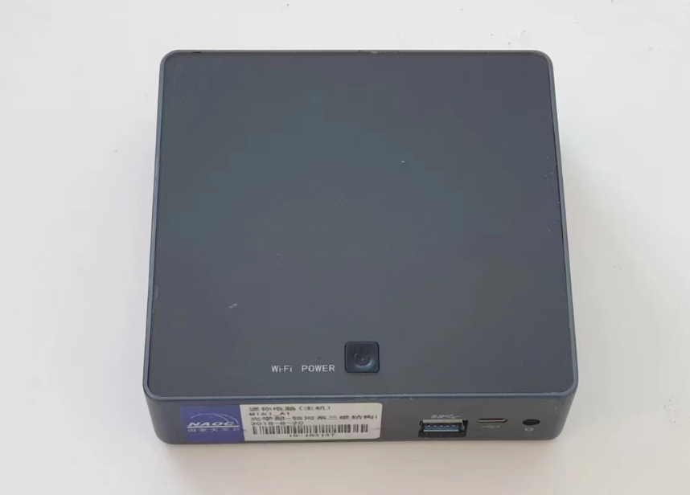
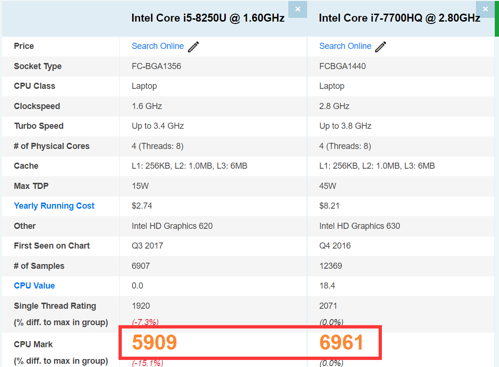
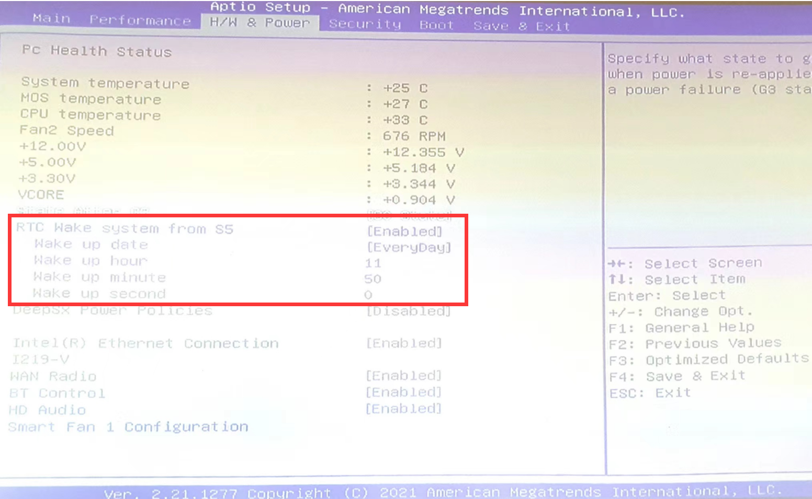
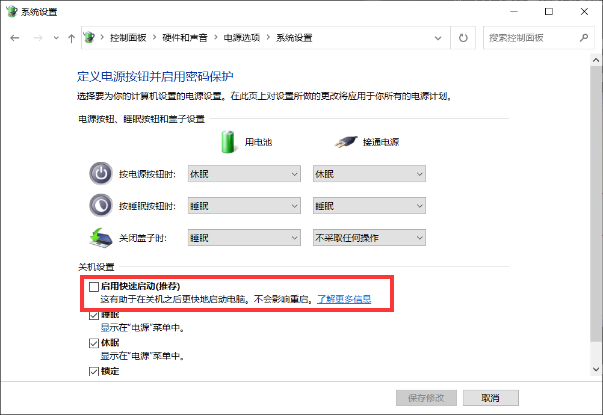

# 电脑部分

## 硬件配置

我们的软件编译目标为 x86 架构 64 位 Windows 系统。未来如果需要，也会提供 Linux 系统或 arm 架构的支持。

首先是要确定电脑的类型。如果电脑安装在室内，那么完全可以将闲置的旧电脑利用起来。如果在室外，就需要选择外形较小的“工控机”、“迷你主机”。

流星监测程序一般对显卡没有要求，因此只需选择 CPU 算力足够的型号即可。可以在各种“CPU 天梯”网站（例如[这个网站](https://www.cpubenchmark.net/cpu_list.php)）上搜索对应 CPU 型号的评分，与其他人的配置对比，就可以知道 CPU 的性能是否足够。

例如，我自己的笔记本电脑 CPU 是 i7-7700HQ，运行流星监控程序没有压力，那么我就可以放心选择搭载 i5-8250U 的工控机，因为这两个 CPU 的评分差不多。

另外，尽可能选配更大的内存和固态硬盘，因为流星出现时需要快速写入文件，否则就会出现丢帧问题。

## 安装

安装在室外的电脑需要一个防水箱（如第一节的图中所示），也很容易买到。不过要特别注意散热和遮阳，有的防水箱没有散热孔，电脑产生的热量无法排出。另外，夏天太阳直射的地方防水箱本身也会非常烫，所以也可以增加一些简单的遮阳。

一般来说金属的防水箱更适合散热，但是金属箱体会阻隔 4G 或 wifi 信号。所以如果使用 wifi 连接网络，路由器最好安装在近处。

电脑可能会因为各种各样的原因断电，所以来电自启功能就非常重要，否则每次都要到拆开防水壳按开机键。部分主板的 bios 设置提供了来电自启功能和定时开机功能，非常方便。注意使用这些功能需要把 windows 的“快速启动”关闭。如果 bios 没有这个功能，可以在电脑上安装一个来电自启的硬件，售价只需要几块钱。

另外，部分 QHY 相机在特定版本 win10 的电脑上，电脑重启后相机无法正常工作。解决这个问题，要么将相机重新拔插，要么将电脑完全断电后再送电开机。因此，安装时最好把电源插头放在容易操作的位置。也可以再加一个可以远程控制的“智能插座”，但是插座本身需要 wifi 连接，如果为此再加路由器，就会提高整个系统的复杂度，不是很推荐。

## 遥控

安装在室外的电脑一般用采用远程桌面的方式遥控。常见的远程桌面软件有：

- windows 远程桌面
- [Teamviewer](https://www.teamviewer.cn/cn/)
- [向日葵](https://sunlogin.oray.com/download?categ=personal)
- [Parsec](https://parsec.app/)
- QQ

这些软件的具体教程可以在网络上找到。在局域网中，最方便的远程桌面是 windows 自带的远程桌面功能。其他几个软件大同小异，都可以在非局域网上进行远程控制。其中 QQ 也有远程桌面功能，可以登录一个 qq 号，设置自动接受远程控制。但是 qq 的远程控制需要把 uac 完全关闭，可能是一个安全隐患。
