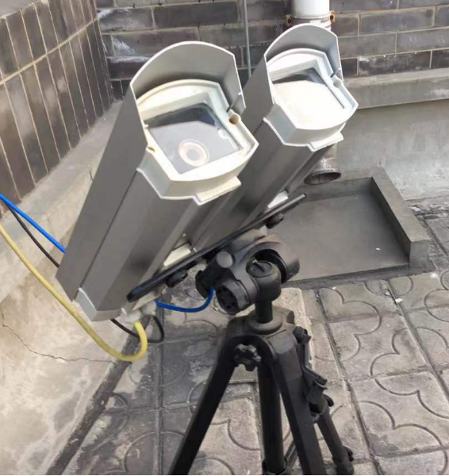
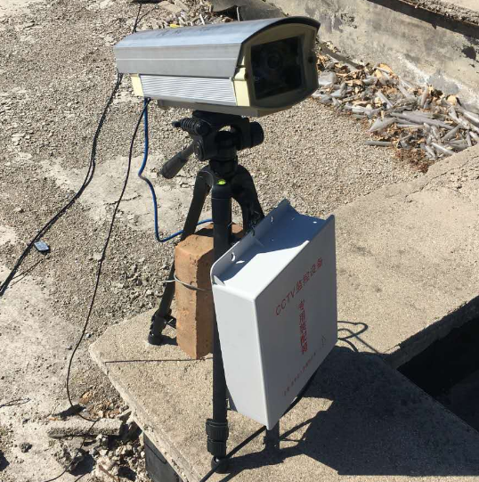
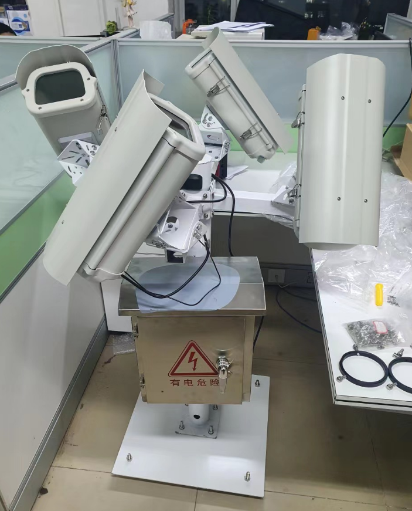

# 从零到一搭建流星监测站

从硬件的角度来说，搭建一套流星监测设备并不困难。市面上有集成度很高的硬件（比如各种网络摄像头），得益于安防行业的发展，我们可以以低廉的价格买到标准化的产品，只需要将零件安装在一起。

很多爱好者已经建造起了自己的流星监测站，从成本的角度，无论是金钱成本还是时间成本，都有许多经验值得借鉴。即使是对希望批量化制造流星监测设备的专业用户，这些经验也非常宝贵。

对于正在看这篇文章的你，我希望你能盘点一下你手边已经有哪些现成的零件，比如旧电脑、闲置的导星相机，再通过本文的指引，了解一还需要准备哪些零件。在购物网站上搜索对应的关键词，就可以找到最适合你的零件，因此本文不会直接给出具体型号和链接。所以希望这几篇文章可以做到“从零到一”。

## 流星监测站的主要构成

一套流星监测站有两个部分：相机部分和电脑部分。相机负责拍摄，相机连在电脑上，电脑运行流星探测程序。主流的流星探测程序都需要电脑长时间开机，所以需要一台专用的电脑。如果电脑的性能允许，可以连接多台相机。

相机安装在户外长时间指向天空，因此防水是必须的。户外用的安防摄像头一般都自带防水，有的还有雨刮器。但是如果用天文相机，就需要我们自己组装防水壳。

在电脑这边，有两种选择。如果使用网络摄像头，可以将电脑安装在室内，用网线把相机和电脑连接在一起。摄像头可以用过网线的POE供电，所以连接相机只需要这一根线。网线的通信距离可以有几十米，因此足够连接到室内。

但是如果用的是天文相机，或者不方便在室内与相机之间连网线的情况下，就需要将电脑与相机安装在一起，也需要做防水处理。天文相机，尤其是采用USB3.0的相机，线缆的长度最多只支持5m，所以很难连接到室内。

最终安装好的设备可能形似下面这几张图，这些是我在不同时期搭建过的流星监测设备，可以看出不同的技术路线。

|  |  |
| ----------------------------- | ----------------------------- |
|  |  |

在接下来的几节中，我们将分别讨论相机、电脑和外壳安装几个方面。
