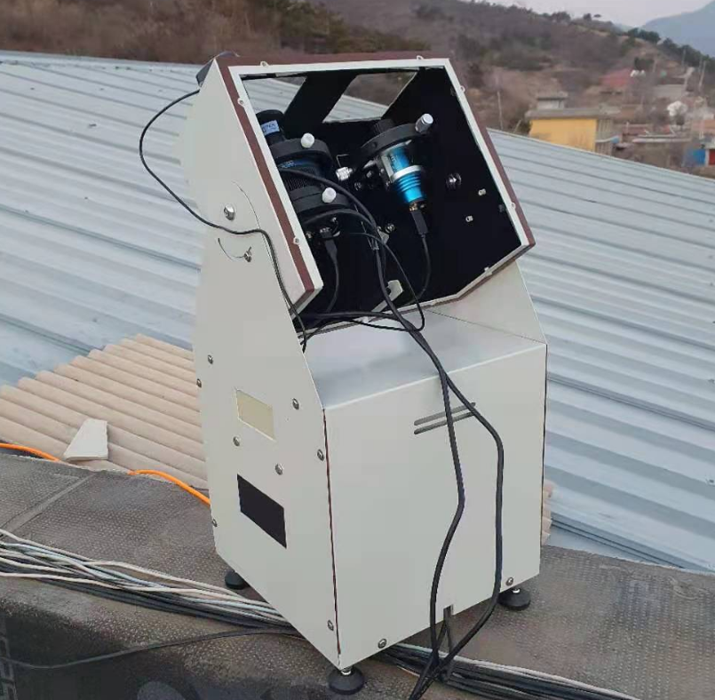
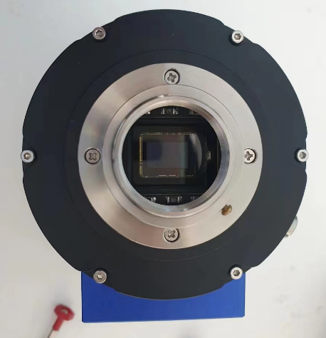
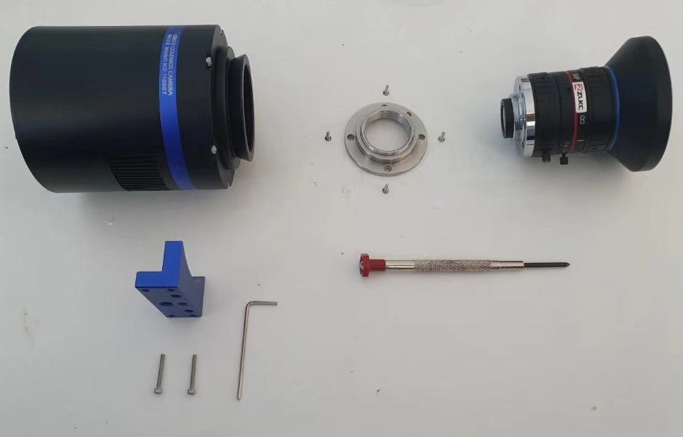
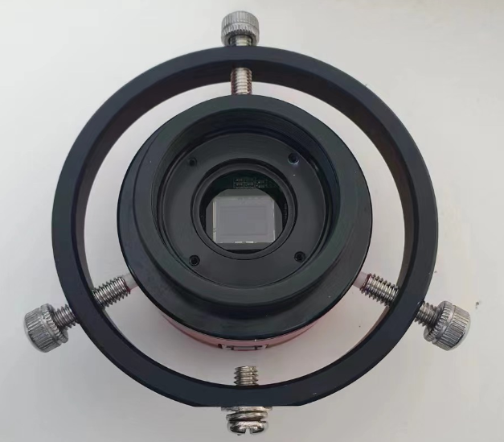
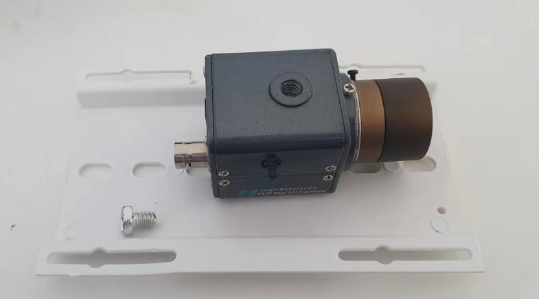
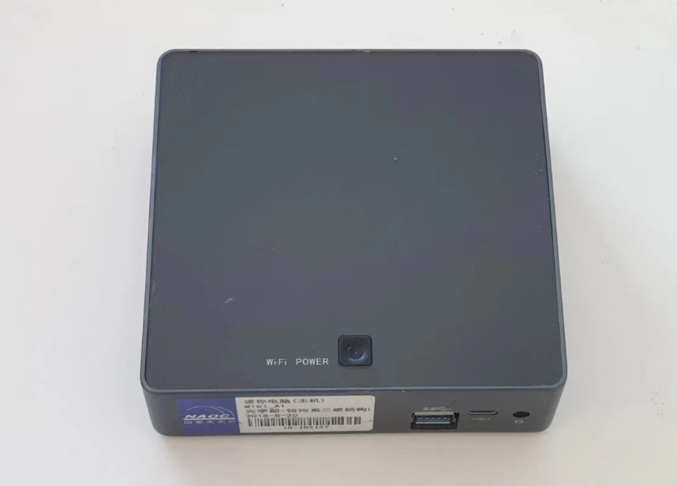
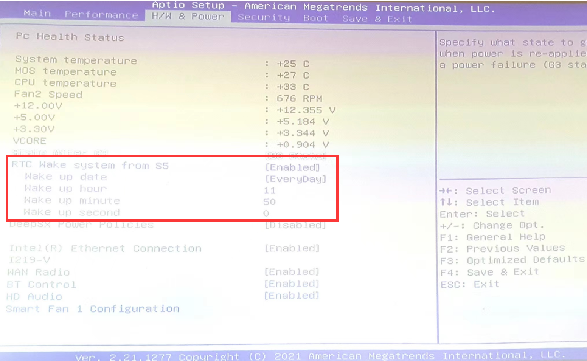
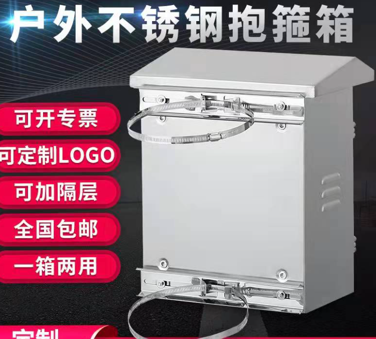

# 从零到一搭建流星监测站

从硬件的角度来说，搭建一套流星监测设备并不困难。市面上有集成度很高的硬件（比如各种网络摄像头），得益于安防行业的发展，我们可以以低廉的价格买到标准化的产品，只需要将零件安装在一起。

很多爱好者已经建造起了自己的流星监测站，从成本的角度，无论是金钱成本还是时间成本，都有许多经验值得借鉴。即使是对希望批量化制造流星监测设备的专业用户，这些经验也非常宝贵。

对于正在看这篇文章的你，我希望你能盘点一下你手边已经有哪些现成的零件，比如旧电脑、闲置的导星相机，再通过本文的指引，了解一还需要准备哪些零件。在购物网站上搜索对应的关键词，就可以找到最适合你的零件，因此本文不会直接给出具体型号和链接。所以希望这篇文章可以做到“从零到一”。

## 流星监测站的主要构成

一套流星监测站有两个部分：相机部分和电脑部分。相机负责拍摄，相机连在电脑上，电脑运行流星探测程序。主流的流星探测程序都需要电脑长时间开机，所以需要一台专用的电脑。如果电脑的性能允许，可以连接多台相机。

相机安装在户外长时间指向天空，因此防水是必须的。户外用的安防摄像头一般都自带防水，有的还有雨刮器。但是如果用天文相机，就需要我们自己组装防水壳。

在电脑这边，有两种选择。如果使用网络摄像头，可以将电脑安装在室内，用网线把相机和电脑连接在一起。摄像头可以用过网线的POE供电，所以连接相机只需要这一根线。网线的通信距离可以有几十米，因此足够连接到室内。

但是如果用的是天文相机，或者不方便在室内与相机之间连网线的情况下，就需要将电脑与相机安装在一起，也需要做防水处理。天文相机，尤其是采用USB3.0的相机，线缆的长度最多只支持5m，所以很难连接到室内。

最终安装好的设备可能形似下面这几张图，这些是我在不同时期搭建过的流星监测设备，可以看出不同的技术路线。

|  |  |
| ----------------------------- | ----------------------------- |
|  |  |

## 相机部分

相机部分其实就一个关注点：防水。主要的工作量就是把相机装在防水壳里，再把防水壳固定在支架上。成品的网络摄像头是最简单的，但是天文相机需要自己组装。

现在市面上的监控产品，无论是相机与防水壳，还是防水壳与支架的安装，主要都采用英制的1/4螺丝。防水壳中配一个底板，将相机安装在这个底板上，再把底板安装在防水壳里，就完成了。1/4螺丝其实就是摄影三脚架用的螺丝，所以监控防水壳可以很方便地装在三脚架上，如果你愿意，也可以把海康威视的摄像头装在星野赤道仪上，虽然没有这个必要。

使用QHY或ZWO等品牌的天文相机时需要自行组装。除了相机之外，还需要单独购买镜头。其实最适合的镜头也是来自于安防行业，它们价格便宜，使用的是CS接口，各项参数与天文相机也是适配的。关于如何选择最合适的镜头，请看[这篇文章](../meteor/camera.md)。

### QHY

QHYCCD的相机在外形上主要分两种，形状与目镜相似的非制冷相机和比较粗大的制冷相机。两者都可以安装CS接口的镜头。

1.25寸直径的非制冷相机自带CS接口的螺纹，所以市售的监控镜头可以直接安装在上面。将圆形的相机安装在防水壳中，需要一个导星镜抱箍。

  
  

而制冷相机安装镜头，需要一个特殊的配件，在购买时需要向卖家索要。拆下相机前的两寸接口，再装上对应接环，就可以安装CS接口的镜头了。防水壳方面，近期出货的QHY制冷相机会附带一个“热承”，可以安装在相机的底部，提供一个1/4螺丝孔。有了这个配件，就很方便将相机安装在防水壳里了。

|                               |                               |
| ----------------------------- | ----------------------------- |
|  |  |

对生产日期较早的相机来说，可以选择用六点式导星镜抱箍固定相机，或者直接用热熔胶将相机粘在底板上（不推荐）。总体来说，制冷式相机由于外形比较大，需要更大的防水壳。

  
  

### ZWO

ZWO相机大同小异，也需要对应的零件来适配监控镜头的CS接口。值得注意的是，ZWO的非制冷相机形状是圆饼形，1/4螺丝孔在背面而不是底部，需要一个L形快装板转接，或者同样使用三点式或六点式抱箍。

|                               |                               |
| ----------------------------- | ----------------------------- |
|  |  |

另外，相机的USB接口位于相机侧面，这个位置也会影响到相机的安装，因此需要选购折角的USB线，买的时候注意折角的方向。下弯的USB3.0线很难找到，所以退而求其次选择左弯或右弯的。

这两个因素都会导致组装好的相机整体直径很大，因此有必要准备足够大的防水罩。

### 监控相机

监控相机的安装是最简便的。摄像头基本都自带1/4螺丝孔位和CS镜头接口，对应组装在一起就好。如果是一体式的室外摄像头，则组装镜头这一步也可以省略了，直接将相机安装在支架上即可。

  

## 电脑部分

### 硬件配置

我们的软件编译目标为x86架构64位Windows系统。未来如果需要，也会提供Linux系统或arm架构的支持。

首先是要确定电脑的类型。如果电脑安装在室内，那么完全可以将闲置的旧电脑利用起来。如果在室外，就需要选择外形较小的“工控机”、“迷你主机”。

  

流星监测程序一般对显卡没有要求，因此只需选择CPU算力足够的型号即可。可以在各种“CPU天梯”网站（例如[这个网站](https://www.cpubenchmark.net/cpu_list.php)）上搜索对应CPU型号的评分，与其他人的配置对比，就可以知道CPU的性能是否足够。

例如，我自己的笔记本电脑CPU是i7-7700HQ，运行流星监控程序没有压力，那么我就可以放心选择搭载i5-8250U的工控机，因为这两个CPU的评分差不多。

  

另外，尽可能选配更大的内存和固态硬盘，因为流星出现时需要快速写入文件，否则就会出现丢帧问题。

### 安装

安装在室外的电脑需要一个防水箱（如第一节的图中所示），也很容易买到。不过要特别注意散热和遮阳，有的防水箱没有散热孔，电脑产生的热量无法排出。另外，夏天太阳直射的地方防水箱本身也会非常烫，所以也可以增加一些简单的遮阳。

一般来说金属的防水箱更适合散热，但是金属箱体会阻隔4G或wifi信号。所以如果使用wifi连接网络，路由器最好安装在近处。

电脑可能会因为各种各样的原因断电，所以来电自启功能就非常重要，否则每次都要到拆开防水壳按开机键。部分主板的bios设置提供了来电自启功能和定时开机功能，非常方便。注意使用这些功能需要把windows的“快速启动”关闭。如果bios没有这个功能，可以在电脑上安装一个来电自启的硬件，售价只需要几块钱。

  

  

另外，部分QHY相机在特定版本win10的电脑上，电脑重启后相机无法正常工作。解决这个问题，要么将相机重新拔插，要么将电脑完全断电后再送电开机。因此，安装时最好把电源插头放在容易操作的位置。也可以再加一个可以远程控制的“智能插座”，但是插座本身需要wifi连接，如果为此再加路由器，就会提高整个系统的复杂度，不是很推荐。

### 遥控

安装在室外的电脑一般用采用远程桌面的方式遥控。常见的远程桌面软件有：

* windows远程桌面
* [Teamviewer](https://www.teamviewer.cn/cn/)
* [向日葵](https://sunlogin.oray.com/download?categ=personal)
* [Parsec](https://parsec.app/)
* QQ
  
这些软件的具体教程可以在网络上找到。在局域网中，最方便的远程桌面是windows自带的远程桌面功能。其他几个软件大同小异，都可以在非局域网上进行远程控制。其中QQ也有远程桌面功能，可以登录一个qq号，设置自动接受远程控制。但是qq的远程控制需要把uac完全关闭，可能是一个安全隐患。

## 支架和安装

将各个部分组装起来需要因地制宜。我设计的流星监测装置会尽力减少对现场环境的依赖，只需要电源、空地，这样可以适用于最多的场景。不过如果你想安装的地点已经有一些基础设施，那么利用现有资源也是很好的选择。

### 监控风格

在网上还是可以找到各种监控用的配件。如果想要安装在电线杆上，可以选用抱箍固定监控支臂，上面再安装相机防水罩；如果想安装在墙上，可以用膨胀螺栓。安装电脑的防水箱也同理。

|                               |                               |
| ----------------------------- | ----------------------------- |
|  |  |

### 相机风格

之前也说了，相机防水壳大多数有1/4螺丝孔，可以与摄影三脚架适配。如果有闲置的三脚架，或者现场没有现成的支架，可以采用这种安装方式。相机的防水壳可以用铁丝或小号的抱箍捆绑在三脚架的一条腿上。同时，为了防止三脚架被大风吹翻，需要在底部固定一些重物。

有了以上的各种零件，一套流星监控设备就可以搭建起来了。安装过程可能不是一帆风顺，在运行过程中，也许也还有种种小问题需要我们去优化。这也是搭建过程的趣味所在。一套设备最开始可能每天晚上都需要照顾，而成熟后可以自动连续运行几个星期，我们每天醒来都可以看到新的流星视频入账。我非常希望所有人都可以享受这种成就感。