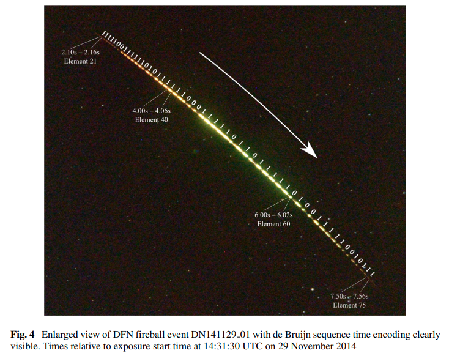
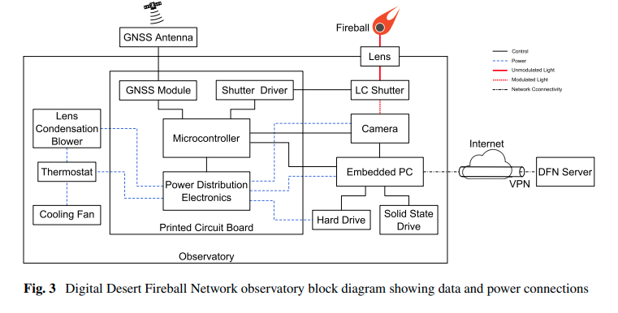
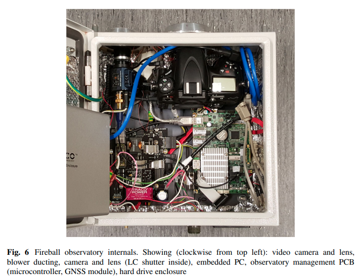
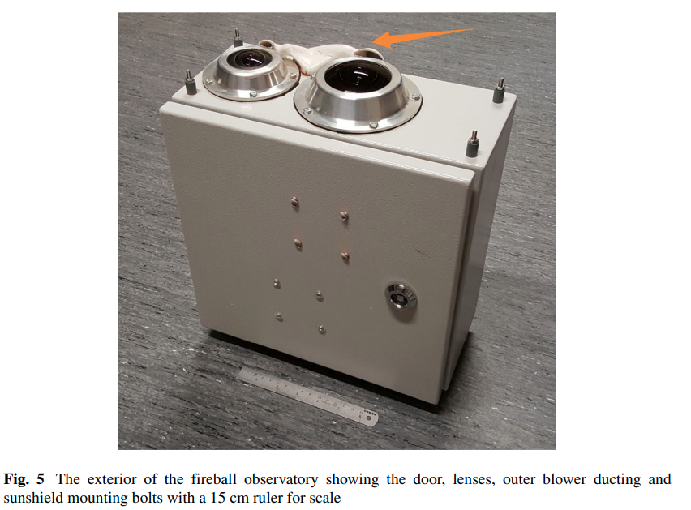
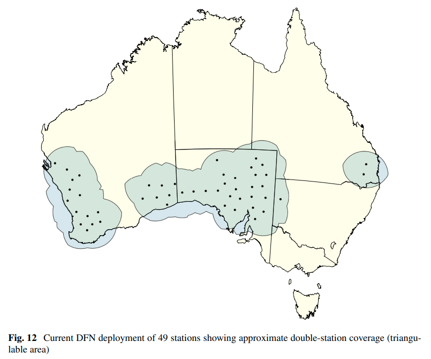
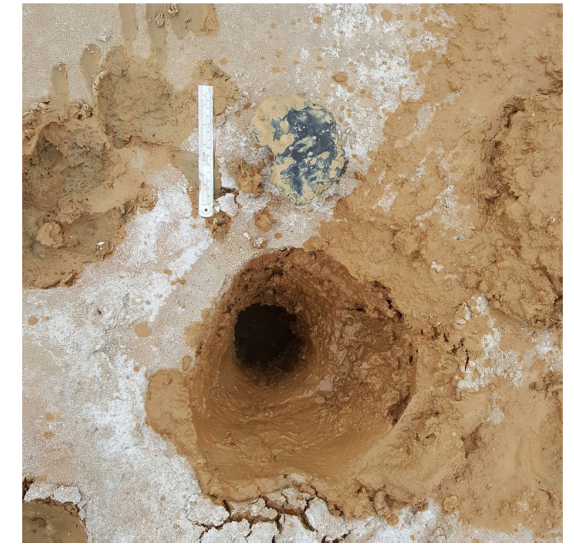
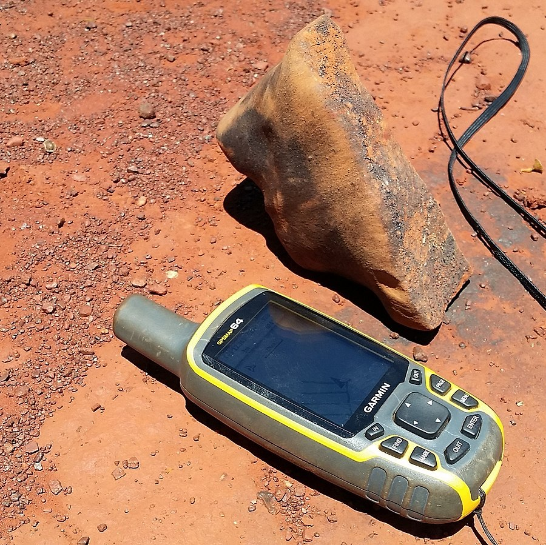
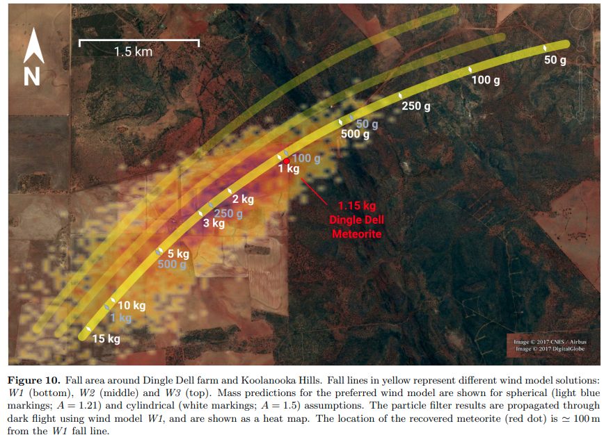

# 澳大利亚沙漠火流星监测网

澳大利亚沙漠火流星监测网[^1]是一个非常独特的流星网络，不是使用视频摄像头而是用普通单反来监控火流星。其中采取了一些有趣的技术，也获得了很好的成果，成功找到了好几颗陨石。本文就详细解读一下这个网络。

本文的内容主要来自论文[How to build a continental scale fireball camera network](https://link.springer.com/article/10.1007/s10686-017-9532-7)。

## 相机设计

DFN 的首要目标是：通过对火流星的多站观测，测量流星的下落轨迹，计算陨石的落点，进而寻找陨石。因此，DFN 并不过多着重于观测到更暗（更多）的流星，而是将关注点放在了对火流星的精确测量上。作者对比了其他流星监测网的方案，没有选择他们的模拟摄像头，转而选择了数码单反。单反的分辨率高于摄像头，所以可以获得更高的空间精度。

DFN 的观测设备主体由一台尼康 D810 和一个鱼眼镜头组成。单反相机的观测模式是连续的 30 秒曝光。有火流星时，流星就会在画面中形成一条轨迹，非常类似于摄影爱好者拍摄出的流星照片。但如果仅仅这样拍摄，流星的时间和速度信息就丢失了，因为流星可能出现在 30 秒曝光中的任意一秒，速度也无法测量出来。

在几十年前用胶片相机进行流星观测时就有相应的技术，那时候采用的是旋转快门，就是在镜头前面放一个匀速旋转的小风扇，以固定的间隔挡住进入镜头的光，这样流星的轨迹就会被切成一段一段，因为时间间隔是已知的，那么测量轨迹片段的长度，就可以计算流星的速度了。

而 DFN 团队在这个基础上更进一步。他们采用的不是固定转速的旋转快门，而是可以自由操控的液晶快门。液晶快门就像是老式计算器的显示屏一样，通电会变成黑色不透光，断电会变透明。用液晶快门也可以控制进入镜头的光，并且没有机械结构，大大增加了可靠性和寿命。

在此基础上，DFN 团队采用了一种特殊的编码（De Bruijn 序列）来控制快门的通断。从第 1 秒到第 30 秒，这种编码完全不重复，就像莫尔斯码一样，将 1 和 0 编码进流星的轨迹。我们从流星的轨迹中解读出一个片段，就可以找到这个片段来自于 1-30 秒的第几秒。这样流星出现的具体时间就测出来了。

液晶快门的通断是由一个单片机控制的，单片机的时间来自于 GPS 的授时。有了这个技术，即使曝光时间长达 30 秒，对流星的时间测量依然可以达到 20ms 量级。

所以，使用 30 秒的曝光时间搭配液晶快门可以获得与视频摄像头相近的时间分辨率，以及更高的空间分辨率。再加上 30 秒只需要存储一张照片，对存储的负担也小于视频摄像头，甚至可以将所有照片都存在硬盘中。

不过，30 秒的曝光大大降低了对暗流星的探测能力。拍摄星空照片时，因为恒星的移动很慢，30 秒曝光过可以拍到很暗的极限星等；但是流星持续时间只有几秒钟，并且是移动目标，亮度是不随曝光时间增长而变亮的。因此长曝光时，暗流星很容易就淹没在天光中了。因此，DFN 对于流星的极限星等只有 0 等左右，远不如视频摄像头。由于这个网络的目的就是寻找陨石，因此暗流星并不重要，这就是它们可以放心采用这种技术路线的原因。

## 外围硬件和网络架构

围绕单反相机，有负责控制和存储数据的电脑，和控制快门的单片机。数据存储在本地的硬盘中，也可以通过有线网络或手机信号进行通信。整个设备的架构如下：

系统用太阳能板供电，所有设备安装在一个防水箱中，相机的镜头从防水箱的上部伸出。由于安装在沙漠中，箱内有较大的散热需求。DFN 团队设计了一个 3D 打印的排风道，将散热风扇向外的排气引向镜头附近，让镜头附近始终有流动的空气，所以也避免了沙尘在镜头表面的堆积。

数据传输方面，尽管设备可以用网络传输数据，但主要还是通过更换硬盘来完成。每台设备配备两个 6TB 的机械硬盘。控制相机的电脑会将鱼眼画面的边缘部分删去，再加上文件压缩算法，写满两个硬盘的时间大约是 8-10 个月。所以每隔半年左右，团队会开车到设备现场进行维护，更换写满的硬盘。车上还会准备一套完整的设备，如果现场的设备出现问题，可以整体替换下来，整个过程可以在一天之内完成。

截至 2016 年底，DFN 共有了 49 个站点，覆盖了大约 250 万平方公里的面积，约占澳大利亚的三分之一。这些站点大多数都位于荒漠之中，如果有陨石坠落，落地的陨石在浅色的地面上比较显眼，因此容易寻找。

## 寻找陨石

2015 年底，DFN 寻获了一颗 1.7kg 的陨石，命名为[murrili](https://en.wikipedia.org/wiki/Murrili_meteorite)。这颗陨石坠落时，有 4 个站点拍摄到了它的轨迹。根据三维定位结果，团队根据空气动力学原理，推算了陨石的落点。值得一提的是，在计算陨石下落的轨迹时，高空中的风向和风速也考虑在内。陨石落在一个盐湖中，深入湖床 42cm。

2016 年，DFN 找到了第二颗陨石，1.15 千克的[Dingle Dell](https://en.wikipedia.org/wiki/Dingle_Dell_meteorite)[^2]。这一次，预报的落点和实际的落点只相差 130m。

[^1]: [How to build a continental scale fireball camera network](https://link.springer.com/article/10.1007/s10686-017-9532-7)
[^2]: [The Dingle Dell meteorite: a Halloween treat from the Main Belt](https://arxiv.org/abs/1803.02557)
