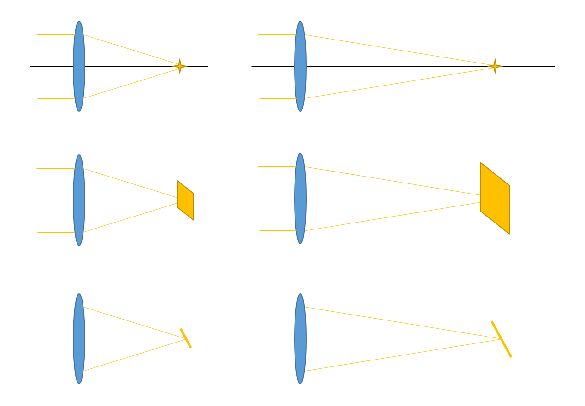
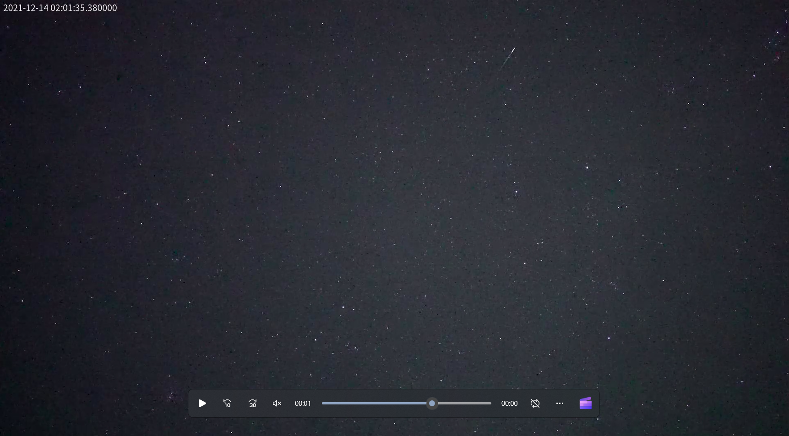

# 哪些相机才能拍到更多流星？

我们在为流星监测设备选购相机时，除了成本，另外一个重要的因素就是：这个相机能不能拍到流星？市面上有很多不同型号的摄像头，即使价格一样，也有一些型号更加适合拍流星，或者说能拍到更多、更暗的流星。如果你用天文相机和镜头自己组装流星相机，相机和镜头的各种参数也需要考虑。流星相对于日常使用的场景，是一种更暗、更小的目标，所以相机在弱光环境下的表现非常重要。

相机的弱光性能受到几个基本原理的制约。在之前的文章[光子到电子到数字](photon_to_digit.md)在我们提到，对于非常暗的光线，对光子计数产生的“泊松噪声”会非常明显，是制约信噪比的重要因素。所以想要降低流星画面的噪声，首要的就是增加每个像素接收到的光子数量。

## 镜头

对于天文望远镜来说，最重要的参数莫过于口径。望远镜的口径越大，极限星等就越高。这就是因为大口径的望远镜可以收集到更多的光子，把所有来自于一颗星的光子都汇聚到传感器上的特定位置，这样我们就可以看到更明亮的星像。流星相机采用的广角镜头，大致的原理也是这样。虽然没有标明，但口径可以用焦距除以光圈来大致估计。口径越大，对恒星的极限星等就越高。

口径可以影响极限星等，但这并不是全部。我们日常用镜头拍摄的景物，大多数是面光源，也就是说，同一个光源发出的光并不是集中在一个像素上，而是有一定的尺寸。镜头的焦距越长，成像的放大率就越大。本来镜头收集到的光子数是一定的，成像的面积越大，那么传感器上单位面积分到的光子就少了，也就是说像变暗了。我们可以想象，对于光圈一定的镜头来说，焦距增加可以带来口径增大，焦距每增大为2倍，那么集光面积就会增大4倍；但同时成像的面积由于焦距增加，也变成了原来的4倍，所以单位面积收到的光子数实际是没变的。所以，在摄影中，决定画面亮度的是光圈而不是口径，这也是镜头上并不标注口径的原因。对于拍摄星云的天文摄影来说也是这样，焦比更小（“更快”）的望远镜更适合深空摄影。

我们对比可以看到，恒星是点状光源，不管放多大都是点状，所以探测极限主要与口径有关；摄影镜头拍摄的是面光源，探测极限主要与光圈（焦比）有关。那么，流星是一种什么光源呢？流星其实是介于两者之间的“线光源”，因为增加焦距时，流星的长度会按比例增加，但是宽度的增加并不明显。所以，流星的“面积”与焦距成线性关系，而不是面光源的平方关系，焦距的增加只能抵消一部分口径的效应，所以流星是介于点光源和面光源之间的特殊情况。

  

所以绕了一圈，流星的探测极限与口径（也就是焦距除以光圈）和光圈都有关系。光圈越大（比如F0.95），焦距越长，拍到的流星就越多，画质就越好。这仿佛什么都没说，不过好在，市面上的镜头最大光圈其实没有很大的差距。比较常见的广角镜头通常光圈是F1.4，有特殊的超大光圈镜头比如F0.95，当然也有一些便宜的镜头光圈只有F2.8，这些镜头的效果就差一些了。

## 相机

上一节我们说，光圈越大，焦距越长，更有利于流星探测。这就带来一个问题：长焦的镜头，装在我的相机上，视野不就变小了吗？拍到流星的概率显然与视野大小有关，所以视野也不能太小。决定相机视野大小的主要有两个因素：镜头焦距和传感器尺寸。焦距除以传感器尺寸，这个值越大，视野就越小。所以，如果选用更大面积的传感器，就可以既增加集光面积，又保持视野不变了。

不过由于镜头光学设计的限制，镜头的成像区域是有限的，传感器的面积不能大于成像区域。比如一个摄像头用的标准镜头，我们并不能把它安装在全画幅单反上当做鱼眼使用。我们选择镜头和相机时，需要注意镜头是适配多大画幅的传感器。传感器的尺寸通常通“英寸”来表示，比如1/1.2英寸，2/3英寸等。在这些数值之上，是更大的APS-C，全画幅，中画幅等相机画幅[^1]。

镜头也都会标明适配的画幅大小。例如佳能的EF-S镜头就适配APS-C画幅，EF镜头就可以适配全画幅。监控用的镜头会标明适配多少英寸的靶面，选购时需要选择大于相机靶面的镜头。对于QHY174相机来说，它的靶面大小是1/1.2英寸，而镜头有1英寸、1/1.8英寸、2/3英寸多种，这时候只能选择更大的1英寸镜头。使用画幅不够大的镜头会出现明显的暗角。

  

其实说到这里，大家可能已经意识到了，在流星探测中“底大一级压死人”这个规律依然成立。站在流星监控顶端的，就是索尼的单反相机加上大光圈的广角镜头。在流星雨期间，其他人的摄像头只能拍到几十颗，这样的设备甚至可以拍到上千颗流星。

  

还有一些其他的因素也会影响流星探测效率。分辨率高的相机画面可能偏暗，因为接收到的光子会分配到更多像素上；CMOS的量子效率和填充因子，影响光子转换成电子的效率；彩色相机的拜耳滤镜会滤掉颜色不符合的光，所以相同的传感器，单色的型号探测流星效率更高。这些因素可能不会带来数量级的差距，不过在实际操作中可以观察到明显的不同。

# 总结

所以，我们选购镜头和相机自行组装流星相机时，可以首先根据预算确定靶面大小。价格相似时，选择靶面更大的相机，例如选174而不是178；然后根据靶面大小，选择对应的镜头。不要过于追求广角：因为广角镜头焦距短，口径小，极限星等较低，有时候画质也较差。选择视野在90度左右的普通广角镜头更适合流星监控。

[^1]:[What is Crop Factor?](https://photographylife.com/what-is-crop-factor)