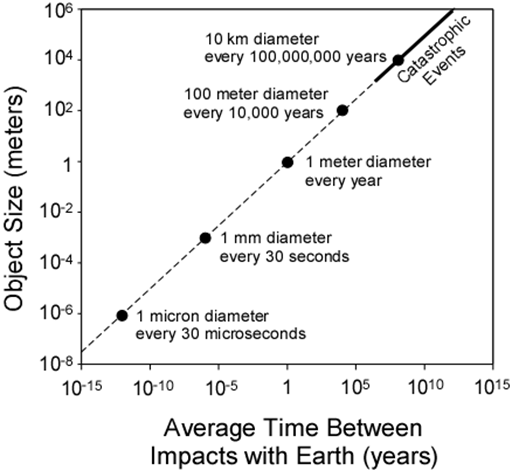
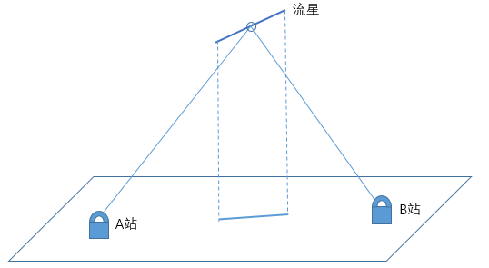

# 流星探测原理（1）

常见的流星体尺寸在厘米、毫米量级，是行星际尘埃尺寸连续谱中的一部分。1米以上的小行星通过地面望远镜可以提前发现，但一米以下就很难了。尺寸在几十厘米、几厘米的流星体，只有在进入地球大气时才可以被观测到。

  

除了之前说的探测长周期彗星之外，流星在其他几个方面也有独特的科学价值。

* 研究太阳系中尘埃的尺寸、分布、演化，从而可以解答一些关于小天体、太阳系形成与演化的问题；
* 已知轨道的陨石非常稀少，目前只有几十颗[^1]，轨道和成分相互对照有很高的科学价值；
* 流星体对空间安全也有一定的威胁，例如曾有通信卫星在英仙座流星雨期间失效，就推测与流星雨活动有关。

流星是一类非常独特的天文现象，对流星的观测自然也是独辟蹊径，非常迥异于其他天象。流星的观测大致可以分为射电观测和可见光观测。两个观测手段都有爱好者和专业研究人员参与。

## 射电观测

在射电波段，主要观测流星和余迹反射的无线电波。无线电波可以是观测者主动发射的（通常称作“流星雷达”），也可以是远处其他发射源发射的，通常是广播电台或者其他信标台。而靠流星余迹反射，甚至可以进行远距离通信，有其特定的应用场景。

射电观测的突出优点是可以昼夜运行。很多流星群的辐射点接近太阳，只在白天升起，不可能在光学波段观测到。也就是说，这些流星雨只发生在白天。雷达观测就发现了很多这样的流星群。另外，射电波段能观测到很暗的流星。例如2012年天龙座流星雨，雷达观测到了ZHR达到9000的爆发，而可见光观测到的流星ZHR只有200左右[^2]。

  

* 上图是实时的[^3]

但是，流星雷达对流星的测量不如光学观测精确。由于波长较长等原因，流星雷达只能将流星的位置精确到千米量级，而光学波段可以达到10米。而依赖广播电台的“听”流星，就完全无法测量流星的方位，只能进行计数。此外，根据一些研究[^4]，射电流星和光学流星的对应关系也并不是很确切。并不是所有光学流星都有无线电回波，这可能与流星轨迹的朝向有关系；同时，流星的亮度与雷达反射面积（RCS）有正相关的关系，但误差比较大。

因为流星雷达技术难度较大，再加上无线电法规的限制，基本没有爱好者涉足。

## 光学观测

光学观测是流星观测的重头戏。光学观测使用简单的设备就可以运行，也很容易达到比较高的精度；同时，观测到的结果也更符合人们心目中对于流星的期待，所以更受大家欢迎。因为较高的精度，使用光学观测数据还可以进行陨石落点预测、发现新流星群、寻找母体彗星等研究，具有很高的价值。

在光学观测上，流星有如下特点：

* **时标短**：流星几乎是我们常见的天文现象中时标最短的。大部分流星持续发光的时间都小于1秒，只有比较亮的慢速流星发光时间会达到几秒钟。在这短短的1秒钟内，我们需要获取流星的轨迹、亮度变化等信息。
* **随机性**：流星是随机出现的。流星基本来自于行星际空间中的小颗粒，这些颗粒进入地球大气之无法被观测到，自然也无法预测。这就造成我们很难使用望远镜去观测流星，因为望远镜的视场太小。
* **距离近**：流星开始发光的位置一般在离地面100km左右。相较于其他天体，流星的距离是非常非常近的。在相隔几十千米的位置观测，流星的位置都会明显不同——这就是三角视差。

我们对在对流星进行光学观测时主要就是围绕着三个特点。因为流星持续时间很短，为了在较短的时间内获取尽可能多的数据，拍摄流星的视频是一个很自然的对策。每一帧视频都代表着流星在这个时间点上的位置，视频连起来就得到了轨迹，从中就可以得到流星的速度信息。

因为流星出现的随机性，为了尽可能多的探测流星，我们只能增加覆盖的天区面积。所以，大部分流星相机都采用的是鱼眼或广角镜头。

而第三点，其实是流星光学观测的立身之本——通过三角视差，可以很方便的测量流星的三维位置。通常天文观测中，距离很远的天体是很难测距的。即使是离太阳较近的恒星，周年视差都小于1角秒，很难测准，因此测出来的距离误差很大。对于流星来说，间隔几十公里就可以得到几十度的视差，因此我们就可以综合多个观测站测量到的流星坐标，计算出流星在三维空间中的位置，三个维度都精确到10m的量级。

  

如上图所示，同一颗流星在两个观测站看来方向是不同的。单个站点此时只能知道流星的方向，不知道流星的距离，所以对于单个站点来说，流星可能的位置在空间中构成一条射线，流星可能在这条射线上的任意一个位置。但如果我们有两个站点的数据，相当于两条射线，那流星的位置只可能是在这两条射线的交点上，流星的位置就确定了。

有的人以为确定流星位置需要3个站点的数据，其实两个站点就够了。因为单站观测可以获取两个维度（比如赤经赤纬）的数据，两个站点就有4个已知量，因此可以解出空间位置的3个未知量。

因此，流星光学观测的主要方式就是：大视场、视频、多站。大视场可以确保尽可能多的拍到流星；视频观测可以获取流星的速度和光变信息；而多站观测才可以获取流星的三维轨迹。同时，观测站点越多，覆盖的范围越大，观测到的流星也就越多。这就要求我们以适当的间隔布置大量的流星相机，这是一个耗费时间精力的工作，所以爱好者在其中的参与至关重要。

[^1]:[Meteorites with photographic orbits](https://www.meteoriteorbits.info/)

[^2]:[The Unexpected 2012 Draconid Meteor Storm](https://arxiv.org/abs/1311.1733)

[^3]:[Radar meteor radiants](https://fireballs.ndc.nasa.gov/cmor-radiants/)

[^4]:[FRIPON: A worldwide network to track incoming meteoroids](https://www.aanda.org/articles/aa/full_html/2020/12/aa38649-20/aa38649-20.html)