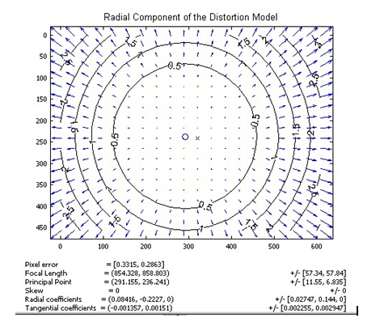
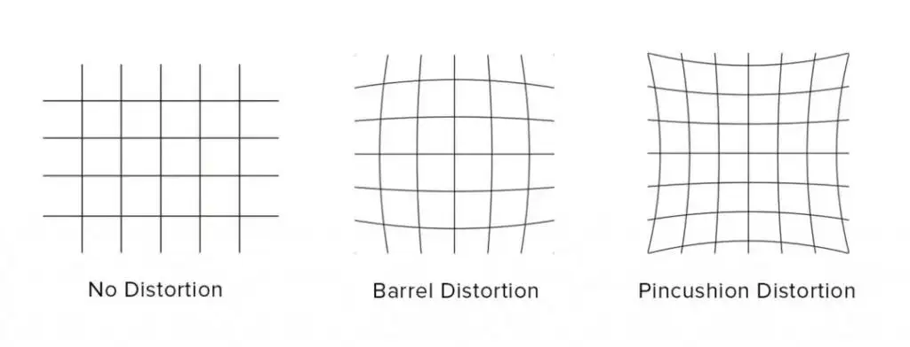
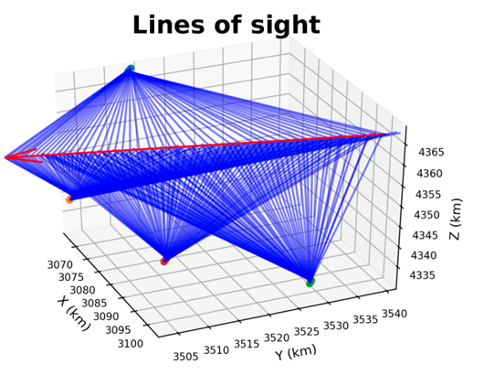

# 流星探测原理（2）

上一篇我们讲了流星的探测手段和光学流星观测的难点和对策，这一篇来讨论一下流星视频多站观测的主要流程。

简而言之，我们对流星的视频观测，就是从用摄像机拍摄天空，到计算出流星轨迹的过程。计算流星的轨迹需要多个站点分别测量流星的坐标，而流星的坐标来自于流星在视频画面中的位置，所以单站必须首先可以拍摄到流星的视频。所以，对流星的视频观测主要分成以下三个步骤：

1. 拍摄到流星的视频
1. 测量流星的视频坐标，并转换成天球坐标
1. 用多站计算流星的三维轨迹

这个思路我们从已有的流星观测软件就可以看出：UFOCapture套件就分成三部分，UFOCapture负责流星监测，UFOAnalyzer负责测量流星坐标，UFOOrbiter负责对流星进行定轨。其他流星监测网的自有软件也基本符合这个思路。

## 拍摄流星的视频

流星的持续时间决定了需要用视频观测，而随机性决定了我们需要大视场长时间观测。一个很明显的道理：你拍到的流星数量，跟观测的时间成正比。所以为了拍摄到更多的流星，流星相机一般是长时间连续工作的，日落后就开始观测，日出前才停止。

与普通的天文观测不同，每个课题申请大型望远镜的观测时间常常以天或者小时计，而观测到的数据可能会处理几个月到一年，因此有大量的时间对图像进行精细的处理。而流星探测不一样，只要天气是好的，相机就会一直开着，一直会产生大量的数据。

因为流星观测拍的是“视频”，它产生的数据量也显著大于大型望远镜（可能LSST这样的巡天望远镜除外）。假设一个1920×1080的单色相机，每个像素1字节，每秒拍摄30帧画面，产生的数据量就是1920×1080×1×30≈60MB/s，每分钟就是3.6GB，每小时就是216GB。如果是彩色相机，数据量还会变成3倍；如果是16位的相机，就再2倍；如果是4k的相机，就再乘以4。积累起来会变成天文数字。

如此多的数据量就造成一个问题：我们常见的“先存下来再慢慢处理”模式就不合适了。一方面，每天存储如此大的数据量成本非常高；另一方面，相机每天工作10个小时，而这些数据必须得在24小时内处理完，否则第二天的数据就又堆积起来了。

更可恨的是，没有流星雨的夜晚，可能一整晚也就只有十几颗流星而已，这十几颗流星的视频加在一起可能也没有一分钟，正可谓沙（）里淘金，投入产出完全不成正比。

以上种种，都指向一种方案：实时检测视频画面中有没有流星，如果有就存储下来，没有就直接把数据扔掉，不写入硬盘里了。那么实时检测流星来得及吗？检测出有流星的时候，是不是流星已经消失了？不用怕，我们可以在内存中缓存前面几秒的视频，当发现有流星的时候，自动从前面几帧开始保存，流星消失之后，再往后保存几帧，防止流星被拦腰截断。很多手机拍照也有时间回溯的功能，用的就是这个原理。

那么这样做，就意味着我们的软件可以实时处理几百MB每秒的数据流，一定要非常高效才行；同时准确性也要尽可能高，如果把流星漏过去了，数据就永远消失了。所以我一直认为，流星监测软件是流星视频观测中的核心技术。正因如此，UFOCapture能在爱好者群体中经久不衰，拥有难以替代的位置。

## 测量流星的坐标

现在我们有了流星的视频，下一步就是测量流星的坐标了。一般来说，我可以指着拍到的视频说：“流星在这！”但这并不是计算机能听懂的方式，甚至也不是其他流星相机的运行者能听懂的方式。

流星定轨对流星坐标测量提出了要求：因为我们要综合多个站点的流星坐标，让它们的“射线”相交于同一点，所以所有观测站都要采用相同的坐标系。如果每个观测站采取的坐标系稍有不同，那相当于射线的方向有偏差，就无法相交到一起；并且，观测站的地理位置也一样重要，如果观测站的位置不对，相当于射线的端点有偏差，几条射线也没法相交到一起。

所以，我们最终输入的流星坐标，一定要采用国际公认的、天地统一的坐标系。这样的坐标系有没有呢？当然有，那就是国际天球参考架ICRS。关于天体测量的内容非常复杂，不过简单来说，我们日常使用的赤经赤纬依赖这个参考架，而地面上的坐标，例如wgs84体系的经纬度，也可以换算到这个参考系里。

我们可以建立一个以地心为坐标原点，坐标轴**不**随地球自转的坐标系（也就是地心惯性坐标系ECI），观测站的坐标就是射线的端点，流星的赤经赤纬就是射线的方向向量。这样所有观测站的观测结果就可以统一了。

思路是这么个思路，实际怎么操作呢？

第一步，我们测量流星在画面上的像素坐标。这一步比较简单，用现有的天文测光软件魔改一下就可以胜任，简单讲就是寻找流星的峰值，或者重心的位置。

第二步，把像素坐标转化成天球坐标。像素坐标跟天球坐标是怎么对应的呢？主要受两个因素影响，第一是相机镜头的畸变，第二是相机的指向。

我们用最简单的近似（尤其对长焦的望远镜成立）来看，视场是x°，有y个像素宽，那么流星与画面中心的距离是z像素的话，那它离画面中心就是z(x/y)度。但对广角镜头来说，这个简单的关系并不完全成立。

一般来说，同一个物体在广角镜头的画面中心或边缘，它大小是不一样的，这就是所谓对的畸变。在画面的边缘，如果“底片比例尺”小于(x/y)的话，就是所谓的桶形畸变，如果大于，就是枕形畸变。

  

  

这些畸变的参数与镜头的光学设计有关，可能会包含在镜头的参数表里；但是也不能直接拿来用，因为实际的畸变还与镜头的安装方式有关：镜头的光轴稍微歪了一点，对焦距离不一样，这些参数就都会变。

而对畸变参数的实际测量，就有几个不同的方式。在计算机视觉领域比较常见的方式是拍摄一个棋盘格的板子，有现成的算法可以寻找棋盘格上的各点，然后计算畸变参数。而在天文上，会采用画面中的恒星来计算像素坐标与天球坐标的关系，其中就涵盖了对畸变的拟合。

而相机的指向也有两个成分：其一是相机是怎么固定在地面上的（也就是相机的朝向），这个基本上是固定的；其二是地球自转到了什么地方，这个只与时间有关。这一步的计算比较简单，就是给坐标乘上几个旋转矩阵就好了。

总的来说，最朴素的方式就是把上面所说的畸变参数、相机指向都测量好，假设它是不随时间变化的（例如我有个鱼眼镜头，我非常精确地把它调整到画面中心正好是天顶），那么只要沿着这个流程计算就好了。不过实际上，相机的畸变和指向都会随时间有微小的变化：在不同季节，热胀冷缩会导致镜头的形状有些许变化；而一阵大风就有可能会把相机的指向吹歪一点。这些误差都会随时间累积。

所以，实际观测中我们都会用画面中恒星的位置来进行实时的校准，在恒星数量足够的时候，每颗流星都做一次。因为恒星的天球坐标是已知的，在同时知道恒星的图像坐标和天球坐标的时候，就可以计算上面说的所有参数了。这样得到的流星坐标是最准确的。

## 多站计算流星的三维轨迹

用两个观测站测量的流星坐标来计算流星的实际位置，本质上就是一个几何问题。求两条直线的交点。在实际操作中，由于观测误差，两条射线是不会严格相交的，而是会稍稍错开一点，此时对流星位置的最佳估计就是与各个射线距离（或距离的平方）之和最小的那个点。

而这么做还有一个隐藏假设：那就是两个站点的时间是精确同步的。我们说到对流星的视频观测时，其实不只是需要短曝光带来的高时间分辨率，还需要与之匹配的高时间精度。很遗憾，大多数爱好者器材并不能做到如此的时间精度。我认为，时间精度是在流星监测中长期被忽视的一个方面，而根据一些研究，时间的偏差会显著影响对流星定轨的精度。

  

一条流星的轨迹包含很多个点，如果我们对每个点都进行三位定位，就可以得出一条折线，这是各种误差造成的。而如果我们假设流星轨迹大致是一条直线，流星在这条直线上逐渐减速，这样就可以对整条轨迹进行拟合，得出的轨迹的误差就比单独每个点的误差小，因此持续时间长、数据点多的流星，定轨精度就更高。而此时，流星轨迹模型的选择就非常重要：近几年有一些文章指出，之前经常采用的一个模型并不非常合理。也有模型无关的定轨程序发布，在之后的文章中我们来详细解读。