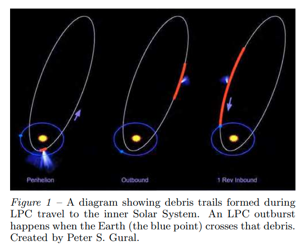
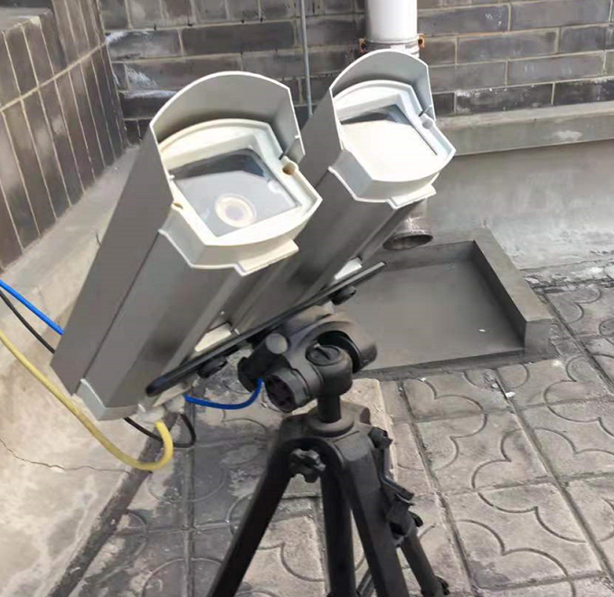
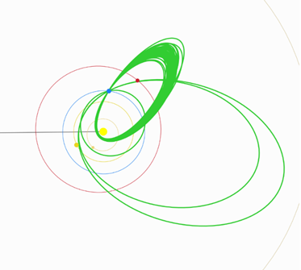

# 前言

话说天下大势，合久必分，分久必合。6500万年前，一次陨石撞击导致了恐龙的灭绝；100多年前，发生在通古斯的神秘爆炸成了绵延几十年的未解之谜；差不多10年前，坠落在车里雅宾斯克的陨石也登上了新闻的头条。小天体撞击地球的危险是真实存在的，这也是为什么各国都在关注小行星的搜寻甚至防御：最近美国的Dart飞行器就演练了一次对小行星的改道。

得益于这些投入，我们对地球周围的小行星有了越来越深刻的认识。科学家发现了大量的近地小行星，并对他们的轨道进行了推算。结果还算是乐观：未来几十年地球受到小行星撞击的概率不算大。有几个原本认为几十年后会撞地球的小行星，例如著名的“阿波菲斯”，它撞击的可能性也逐渐被排除。

近地小行星的研究让大家暂时松了一口气，但还有一个概率低一些但是更可怕的危险源——长周期彗星。彗星撞地球的可能性也不算大，但彗星撞地球的危险性比小行星撞地球更严重一些。因为小行星可以通过巡天发现，然后预测到几十年后的撞击；但是撞击地球的彗星，因为远离太阳的时候无法观测到，从发现到撞击就只有一两年了，以现在的科技水平很可能来不及反应。

那有什么办法可以提前发现这些彗星呢？流星。彗星上一次回归的时候会在轨道上散落一些碎屑，这些碎屑在彗星轨道上与本体逐渐拉开距离，于是就会有一些碎屑提前一段时间撞上地球。从地球上看，就是出现了一场从来没见过的流星雨。这种不寻常的流星雨，就可以提供杀手彗星的一些蛛丝马迹。

  

于是，在地球表面建立流星监测网，就可以发现这样的流星雨，然后就可以发现杀手彗星，就可以完成从世界末日中拯救全人类的壮举——这份荣耀既属于运行设备的科学家，也属于听信了这个故事的负责拨款的人。

上面这些论证基本来自于我前几天看到的一篇论文的绪论部分。是的，我能想象到你现在皱着眉头将信将疑的表情，因为我也是这样。不过我得承认，这个故事的质量远超过我之前各种ppt的开头几页，所以接下来我打算经常给别人讲这个。

我从很早就开始对流星监控感兴趣。本科的时候我就有一个流星摄像头放在教学楼的楼顶，那时候跟大家一样使用UFOCapture这个软件，运行的很不错，中间还搞了流星雨直播和日常的慢直播。上了研究生之后，机缘巧合，兜兜转转，又继续做流星了。

  

当年国内做流星监控的爱好者非常多，大家的设备基本都是watec-902h和它的变种，720×576的分辨率。后面几年，逐步发展成网络摄像头。这种一般来自于安保摄像头，对弱光的敏感度也不错，并且这种摄像头用到的CMOS芯片其实跟更贵的天文CMOS相机是同款，画质有保障。最开始还有人自己买裸板组装，后面比如海康威视等品牌的摄像头占领视场之后，大家的设备慢慢就转换成了这种。网络摄像头的功能比之前丰富得多，但很可惜，有些遭到了滥用。

我刚来到国家天文台的时候，跟老师请教一些技术细节，逐渐发现了一些UFOCapture的一些缺点。最明显的是，老师直接跟我说，天文领域用的文件格式是fits，你发给我这个avi是怎么回事？UFOCapture保存的只是适合肉眼观看的视频，并不能保存各种天文工具需要的fits。但另一方面，各个领域的科研对数据的渴求是无止境的，大家经常提到流星检测网可以做各种各样的研究，这是非常大的激励。

我尝试总结一下，对于爱好者来说，现在的流星监测技术栈还存在以下这些问题：

* UFOCapture对摄像头的兼容依然不算好，网络摄像头需要用rtsp-OBS插件-UFO这样的转接方式，这个过程也会消耗很大的cpu算力；
* 真正会用UFOAnalyzer和UFoOrbiter对流星进行多站定轨的人还是很少，这两个软件汉化不完全、操作很复杂；
* 这就导致，收集全国的流星数据，对流星进行常态化的定轨，还是非常的困难，积累的数据只是以视频的形式分散在各自的电脑中。

另一方面，从科学研究的视角，也提出了这些问题：

* 现有的摄像头参数设置不正确，让流星视频“好看”的设置反而降低了数据质量；
* 文件格式无法兼容，avi视频只能在UFO系列软件中使用，而不能进入天文学现有的工具链中进行深度处理；
* 时间精度没有得到足够的重视，在定轨时也会造成很大的误差。

所以，我们不要忘记，UFOCapture是一个将近20年前的软件，它的很多设计，已经无法适应现在的技术水平和天文学生态圈了。我们观察世界上其他流星监测网，最近几年规模比较大的网络，无一例外都是采用了自研的软件，有些甚至是开源的。所以开发一套适应时代的流星软件是很有必要的。

这就是我研究生期间大部分时间做的事情。与UFO类似，我的软件也分成三部分，对应流星观测中的三个步骤：观测，测量和定轨。我们的硬件采用的是天文CMOS相机，叶建荣网络摄像头，从发现流星开始，到最后得到流星体轨道，都可以自动完成。在2020年和2021年的双子座流星雨期间，我们的几套设备拍到了上千颗流星，对流星轨迹的测量精度也达到了很高的水平，可以精确到几十米。这些工作就构成了我正在写的一篇论文。

  

但是做到这还不够。如果用论文画上句点的话，我写的软件，还是会成为下一个UFO，这些东西会被束之高阁、最后无人问津。要把软件推广开，产生真正的科学数据，完成之前所有的画饼，还差最后一步。这一步是一大步。

在强悍的技术大佬的加持下，流星监控软件不再是一个单独的软件，而是跟云端的服务器形成的一个有机整体，数据和指令可以自由流动。这一切，就是因为流星监测的核心——多站。这其实就是前几年比较时髦的SaaS架构。

* 所有的流星监测站都是一个远程天文台。不用在电脑上设置，在手机和其他电脑上登陆网页，就可以远程控制流星相机观测。还可以把自己的设备授权给朋友互相管理。
* 主要面向天文CMOS相机，也兼容现在的网络摄像头。我们希望给大家使用更专业的设备，它们产生的数据质量更高。
* 有丰富的可视化小工具，可以生成“增强现实”的流星视频，可以直接导出竖屏视频；还有流星照片叠加成全景图，就像[这样](http://demo.meteoroid.fit/pano/album.html)。甚至还可以制作流星的[3D视频](https://www.bilibili.com/video/BV1QP4y177V2)。
* 流星数据可以自动、实时地上传到服务器，与其他人的结果一起做多站定轨。这样，流星体的轨道、来源，还有未来预测陨石的落点，就都可以实现了。
* 不只是流星，其他有趣的现象，比如人造卫星、飞机，以及精灵闪电，都可以得到兼顾。

  

陨石这一点非常有意思：我们可以做到流星的视频在流星消失之后2秒就开始处理，计算单站的流星坐标需要大概30秒，上传到服务器后，多站定轨算出轨迹需要大概10秒，然后再推算陨石的落点。总的来说，流星消失之后1分钟左右，就有可能计算出陨石的落点！这时候陨石可能还没落地呢。“预警”陨石也算是我们的一个努力方向。

在接下来的文章中，我会逐渐详细解释我对流星监控的思考，但愿写到最后，我们最后的产品就可以跟大家见面了。

<iframe src="//player.bilibili.com/player.html?aid=856138716&bvid=BV19V4y1J7sa&cid=779800466&page=1" scrolling="no" border="0" frameborder="no" framespacing="0" allowfullscreen="true" width="100%" height="450px"> </iframe>
