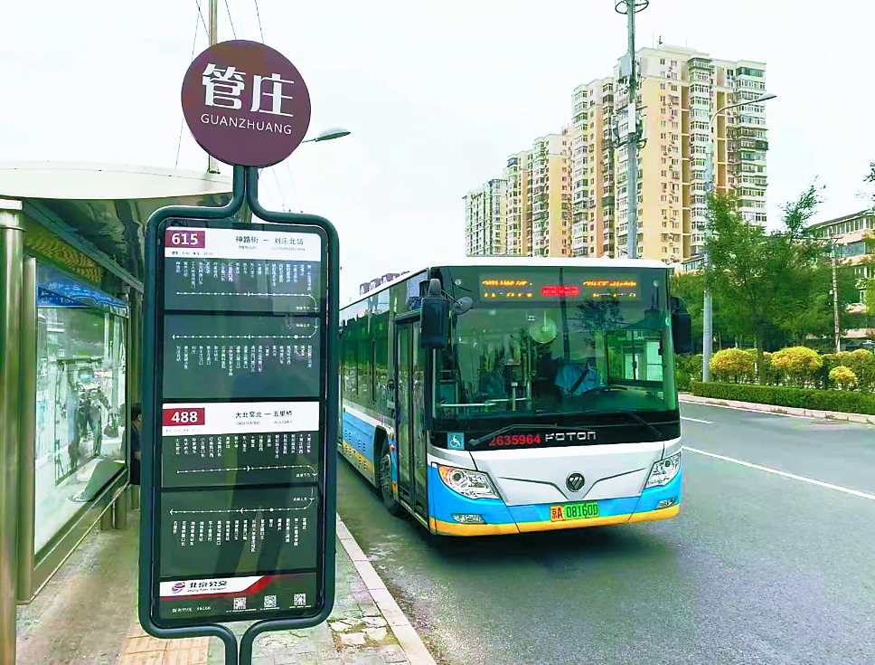
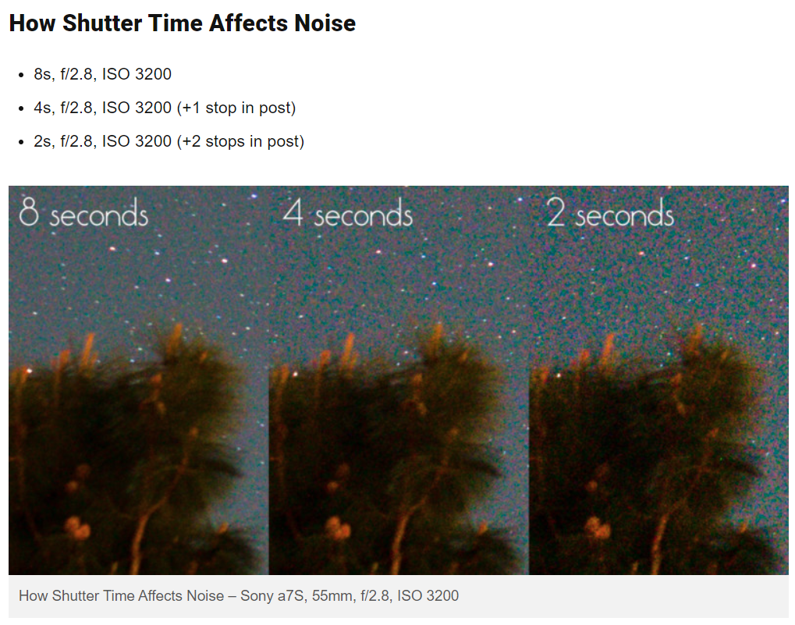
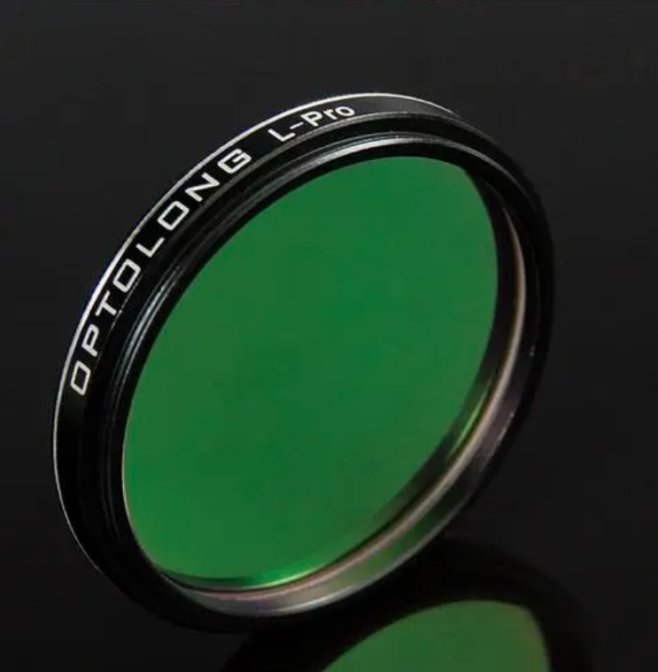
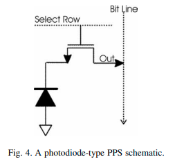
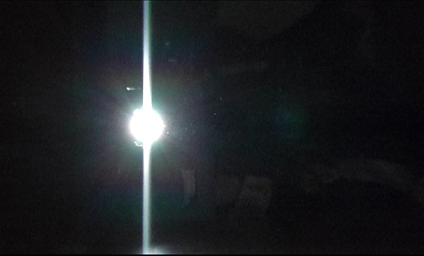
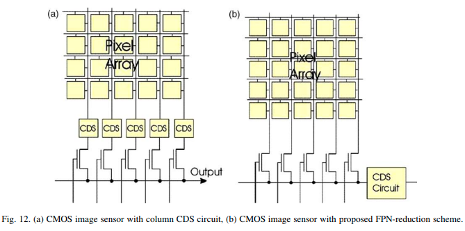

# 光子到电子到数字

光从各种光源发出来，经过遥远的距离，再经过镜头或者人眼的折射，落在传感器或者视网膜上。人眼和摄像头目的都是一样的：测量来自这束光的亮度。尤其是摄像头，它会把光的亮度转化成数字，而显示器再把数字再转化回亮度，这我们就能在屏幕上见到摄像头拍到的画面了。

有一个基本的物理事实：一束光，并不是“连续”的。我们知道光子的概念，光的能量是一份一份传播的，而相机也是对落在上面的光子进行计数。对于老式的胶片相机，光子会导致银盐颗粒发生分解，然后通过各种化学反应变成颜色的深度。现在大家常用的CCD、CMOS相机，传感器是由半导体组成的，光子落在上面会激发出电子，从而将光子数变成了更容易测量的电子数。然后经过放大、模数转换，就变成了可以传输和储存的数字。

在这个过程中，总会产生一部分噪声。所谓噪声，就是测量结果相对原始值的偏离，而尽可能降低噪声，才可以得到高质量的画面。有个概念就是信噪比，顾名思义，信噪比就是信号/噪声。只要尽力降低噪声，信噪比就越高，测量结果就越好。

接下来我们就详细分析光子-电子-数字的转换，了解各种噪声的源头，从而可以找到流星相机的关键参数，和优化设计的方向。有了这篇文章的知识准备，下一篇文章将会从源头上讨论流星相机一些很常见的错误设置。

简便起见，我采用的是非常简化的模型。真实的图像传感器的原理和性质非常复杂，基本是一门单独的学科。油管上有[一个很不错的系列](https://www.youtube.com/playlist?list=PLD9DE4E7DCC55AB4C)[^1]解释图像传感器中的噪声，推荐大家观看。

## 数光子

刚才我们说了，相机传感器可以对落在上面的光子进行计数。而光子的数量，本身就带有随机性，而随机性就会带来噪声。平时我们不会注意到这种随机性，因为白天或者灯光下光子数量很多，随机性被抹掉了，而在拍摄星空时，光子的数量很少，这种效应就很明显。我们进行一点计算就会发现，对于我们用肉眼观察6等的恒星，每秒钟进入我们眼中的光子数量只有10个左右！对于跟人眼尺寸差不多的摄像头，这个数字也差不多。可见人眼还是一台很不错的相机。

关于“光子”为什么会带有这种天然的噪声，我们用一个日常生活中的场景来类比。我们在公交站等公交车，对于10分钟一班的车，有时候两辆车的间隔会是15分钟，有时候又是10分钟。而如果一班车我们不知道发车频率，我们可以在公交站边等边算时间，用这个时间间隔来估算。

  

如果我们在公交站等了10分钟，这10分钟一共来了1辆车，那这辆车的发车间隔可能是多少？当然最佳估计就是10分钟一辆（每小时6班），但完全有可能是15分钟1辆（每小时4班），也很有可能是5分钟一辆（每小时12班）。这种时候你就非常拿不准这个发车频率。

而如果你在站台上等了两个小时，等到了12辆车，那你说这趟车是每小时6辆的把握就大得多了。每小时8班、每小时5班的概率都大大降低。如果你等的时间更久，等了整整一天，你对发车频率的测量就更有把握了。

这个例子就表明，“一个一个”随机出现的事件，对出现概率的测量是随着出现次数增加逐渐变精确的。在数学上，这就是所谓的“泊松噪声”。它的大小等于光子的平方根，比如100个光子，泊松噪声的水平是10个光子，此时信噪比是10，而10000个光子，泊松噪声是100个光子，信噪比是100。

这基本就是为什么越暗的星就越难拍到。并且3s/ISO5000曝光拍出来的照片明显不如30s/ISO500，也是这个原因。在这个问题上是没法作弊的，比如我问：我把每个光子都转变成100个计数，100个光子跟以前10000个光子一样亮了，噪声会减小吗？并不会，因为这时候噪声是被等比例放大了。就像是数公交车的时候，每过一辆车就在本子上记100，最后没有什么区别。

如下图，[这篇文章](https://petapixel.com/2017/03/22/find-best-iso-astrophotography-dynamic-range-noise/)[^2]给出的例子中，虽然后期被拉到相同的亮度，曝光短的照片明显噪声更大。

  

## 暗电流和背景天光

这里我们要注意，虽然放在一起讨论，暗电流和背景天光的来源完全不同。

背景天光很好理解，那就是大气发射和反射的光。随着曝光时间，整个画面都变亮了，一部分原因就是背景天光。在城市中背景天光很亮，这就造成我们在城市中看不见银河，看不见很亮的星。

暗电流是另一方面。理论上，只要温度不是绝对零度，都会有一些电子自发地跳出来。于是即使没有光子照射，拍出来画面也是有计数的，并且正比于曝光时间。

之所以把它们合在一起写，是因为他们观测上产生的效果是差不多的：就是随曝光时间均匀增加的计数。问题来了：这些计数也有泊松噪声。深空摄影中经常会使用“暗场”来去掉图像中的暗电流，而拍摄星野也可以用ps减掉背景天光，虽然本身减掉了，但他们的噪声依然存在，这样总和的噪声就变大了。

我们修改一下数公交车的场景，除了你要数的那趟公交车之外，还有每小时60班其他公交车经过这个站，你数了10分钟，总共确实数到11辆。按理说应该扣掉10辆其他的公交车，但问题是真的正好经过了10辆其他公交车吗？也有可能是9+2辆或者11+0辆，那你对目标的计数就差了非常非常多，没有精度可言了。

光子数量也是一样的。本来100个来自目标的光子可以带来10的信噪比，但如果又有了800个光子的背景天光，一共900个光子，那么噪声就是30光子，信噪比就只剩3.33了。这就是为什么天文观测一定要寻找光污染最小的地方，还有CCD需要制冷来降低暗电流，就是因为它们带来的噪声是无法去除的。

唯一能去除的方法就是不要让这些额外的光子到达传感器。比如有“光害滤镜”这种产品，把一部分天光滤掉，这样就可以出现在城市里拍银河的神片了。

  

## 读出噪声

图像传感器是如何将光子转换成电子的？可以从一个PN结开始理解。我们给PN结通上反向偏压，此时几乎没有电流，是因为PN结上形成了一个势垒，电子能量不够不能通过。但这时如果有一个光子撞到一个电子，电子受到了激发，就会越过势垒跑到另一边，于是就形成了光电流。光子和电子的相互作用是一对一的，也就是说，电子的数量就代表着光子的数量，它们的比值就是大名鼎鼎的量子效率。通常量子效率小于100%，但厂商都在朝这个方向努力，最好的CMOS芯片已经达到90%以上。

而产生的光电子十分珍贵，不能让它白白溜走。这些电子暂存在PN结的另一边，这里相当于一个电容。在曝光的时候电子逐渐增多，这就是为什么图像亮度正比于曝光时间。而在曝光结束之后，一个特殊的“开关”打开，这些电子可以通过另一条通路流走，这就是所谓的读出。

  [^3]

在这个电路上，有几个环节会造成噪声。光电子在沿着导线读出来的时候，最终出来的电子有可能会多几个少几个，这是因为导线中自带的电子也会热运动，所以有一些随机性。这种噪声叫做热噪声，遵循高斯分布，是一种“白噪声”。另一个是电子在经过各种门电路的时候，因为半导体的缺陷，有时候会“卡住”，过一段时间才释放出来，这叫做“闪烁”噪声，是一种低频噪声。这两种噪声可以认为与曝光时间无关，每次读出产生的噪声水平是差不多的。

这些转移出来的光电子，会经过放大电路进行扩增（“增益”），然后流过ADC。这时电子的数量就会被记录下来，成为一个个代表亮度的数字（叫做ADU值）。ADU输出的是一个固定位数的整数，就是我们常说的“位宽”或“位深”，例如12-bit的CMOS芯片意味着它的ADU可以输出12-bit整数，取值范围是0-4095。而16-bit的CCD，输出的是0-65535的整数。如果电子太多超过了上述的范围，输出的结果就不会再高了，而是停在4095或65535，这就是所谓的过曝。

除了ADU导致的过曝之外，其实前一步像素中储存的电子数也是有上限的。电容靠电压来吸住电荷，而如果电荷非常多，电容两边的电压就会变高，进而降低了PN结两边的偏压。所以因为PN结是单向导电的，一旦偏压消失，新来的电子就会重新通过PN结溜走。所以，每个像素能储存的电子数是有限的，这就是所谓的“满阱”。对于CCD来说，这些多余的电子会外溢到相邻的像素中，这就是CCD特有的smearing（漏光）现象。

  [^4]

最后，ADU在对电子计数时，因为只能输出整数，那么在取整时也会造成一些噪声。如果ADC把每10个电子算作一个ADU，0电子是0ADU，那么其实5-14电子都会当做1，而15-24都会当做2。所以平均来看，测量结果与实际的电子数有一定出入，这就是所谓的量化噪声。但是如果把1个电子算作一个ADU，1就是1，2就是2，那这种噪声就不存在了。因此，增益（单位是e/ADU，这个值与大家日常用的增益值相反，增益越大图像越暗）越大，量化噪声就越大。

总结一下：在读出过程中，发生在像素内部的噪声主要有热噪声、闪烁噪声、量化噪声等，这些噪声来源构成了所谓的“读出噪声”。因为读出噪声的存在，有时候ADU测量出的电子数有可能是负值，但因为输出数据不能是负的，所以会截断成0。与过曝一样，这种截断也会造成图像的失真，所以会有所谓的“偏置”设置来将ADC的零点稍稍提升，让无光照对应一个非零的ADU值。这个偏置值在处理图像时也需要减掉，这就是所谓的“偏置场”。

## 像素间的不均匀性

天文摄影中“除平场”的操作大家肯定不陌生，这个操作就与像素间的不均匀性有关。因为制造工艺的限制，每个像素对光的相应不是完全一样的，对于电路复杂的CMOS来说尤其如此。CMOS标称的量子效率、增益是一个平均值，其实不同的像素量子效率和增益会有所不同，并且每一行或每一列也会有集体的偏离。这些就使画面整体出现一个固定的噪声，就是所谓的固定模式噪声（PRNU）。好在这种噪声是固定的，在观测前后拍摄平场就可以修正。

  [^3]

平场的原理就是：拍摄一个已知均匀的发光体，借此凸显像素间的不确定性。假如拍摄平场时，一个像素拍到了110而相邻的像素拍到了90，拍摄目标时前一个像素拍到了190而后一个像素拍到了250，那么两个像素实际的值就分别是190/110×100和250/90×100。

除此之外，相同温度下每个像素暗电流的大小也是不同的，因此也有对应的固定模式噪声。CMOS芯片中很常见一种暗电流很高的坏像素，曝光时间一长这种像素很快就饱和了，所以在长曝光照片中表现为恒亮的坏像素。

[^1]:[Image Sensor Noise Sources](https://www.youtube.com/playlist?list=PLD9DE4E7DCC55AB4C)

[^2]:[How to Find the Best ISO for Astrophotography: Dynamic Range and Noise](https://petapixel.com/2017/03/22/find-best-iso-astrophotography-dynamic-range-noise/)

[^3]:[Review of CMOS image sensors](https://www.sciencedirect.com/science/article/pii/S0026269205002764)

[^4]:[File:Vertical smear.jpg](https://commons.wikimedia.org/wiki/File:Vertical_smear.jpg)