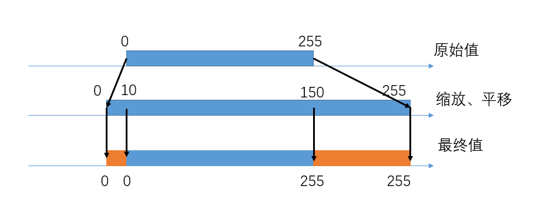

# 通通拉满！网络摄像头的错误设置

电影里偶尔会出现这样的桥段：街道上的摄像头拍到一张车辆的照片，这时候大佬对着小喽啰喊，放大！增强！然后小喽啰一通操作，画面越放越大，车的车牌号、驾驶员就都变得清清楚楚了。

我们都知道在现实中这种操作显然不存在，望远镜的分辨率和极限星等受口径限制。所以，在拍摄流星时，必然会撞到这些物理定律设置的障碍。

不过有意思的是，本来用于安保的网络摄像头很早就提供了“降噪”功能。只要打开降噪功能，晚上的画面立刻就变得清晰了许多，本来噪声密布的夜空瞬间安静了下来，很多本来看不到的星星也浮现了出来。这是怎么做到的？难道安保相机有一些不为人知的算法？为什么这样的技术没有应用在天文领域呢？不知道你有没有注意到这一点：虽然画面变“好看”了，拍到的流星好像并没有增多。实际上，“降噪”也并不是没有代价的。

  

本文就来讨论一下网络摄像头的一些错误设置，从原理出发，分析这些设置为什么管用、又为什么有害。

## 降噪

我们先来看两段流星视频样本。第一个样本开启了刚才说的“降噪”功能，第二个是CMOS相机输出的原始视频，没有经过处理。两段视频的观感非常不同。

很明显，第一段段视频里天空背景非常清晰平滑，而反观第二段视频，画面中全都是噪点，显得画质很低。但是，两段视频中流星的形态也完全不同，第一段视频里流星有长长的尾巴，运动过程是慢慢变亮慢慢变暗，像是水波纹一样；而第二段视频里的流星只有一个亮点，但运动轨迹显得干脆利落，没有尾巴，还可以看出剧烈的光变和爆裂。

上一篇文章里我们讲过，在恒星、流星这样的亮度范围，光子的泊松噪声非常明显，它受数学规律支配，与设备无关。既然如此，第一段视频里噪声是怎么去除的？其实道理非常简单，那就是取平均。

例如上篇文章中讲的数公交车的场景，如果只数10分钟，噪声就非常大，而如果数了2小时，噪声就比较小了。而如果我们数了12个10分钟，然后把结果取平均，其实相当于数了两个小时，所以平均到10分钟之内，噪声水平就比之前小了很多。顺带说一句，这就是深空摄影中“叠加降噪”的手法，多张照片叠加就相当关于累积了曝光时间，所以可以得到很高的信噪比。

而我们的摄像头，也是采用这种“天文”方法来降噪。单帧的图像噪声太大不好看？那就把每一帧都跟之前10帧取平均值。受益的场景其实是夜间的安保：现在每一帧都相当于10帧的长曝光，如果画面中大部分是静止的景物，这样的叠加降噪可以大大提升清晰度，这样作为卖点会非常吸引顾客。而出现小偷毕竟只是小概率事件，大部分时候值班员盯着一个干净的监控画面会感到心情非常舒畅。

但是对移动的目标这样做问题就很大了。尤其是流星，速度飞快，你取平均跟谁取呢？只能与流星出现之前的10帧取平均，但是那些画面里又没有流星
。那流星的信号实际上是被削弱了。另外，流星飞过后的地方，本来只有天空背景，但却被平均进了刚飞过的流星的亮度，也变得很亮，所以流星就有了长长的尾巴。

上图是一个假想的像素接收到的亮度曲线。原始数据是蓝线，流星经过这个像素的时间很短，只有4帧，体现为一个尖峰，而噪声比较大。如果我们把每个点都与之前10个点取平均，结果就是橙线。可以看到，噪声大大降低，但是流星的峰值变低了，持续时间却变长了。并且，流星出现的时间整体比实际更晚。

那么，开启了降噪设置进行流星监测有什么坏处呢？首先，这种设置并不能增加拍到的流星数。叠加降噪只对静止的天体管用，所以我们看到恒星的数量变多了；但是经过平均，流星的亮度降低了，也分散了。很多人都说降噪功能可以增加极限星等，对用来测极限星等的恒星来说不假，但是对流星的极限星等并没有增加。

其次，拍到的流星视频，科学价值大打折扣。最重要的流星位置测量不准确了。我们测量每一帧上流星的坐标用来定轨，而经过降噪后的画面，流星的亮度大多集中在流星过后那个虚假的尾巴上，那么测量出来的流星位置就比真实的位置落后一些。如果流星有减速和光变，那情况更复杂，造成的误差难以修正。另外，流星的光变曲线也相当于被抹平了，无法用来进行更深层次的研究。

## 增益

这些设置基本来自于另一个需求：增加流星的“显眼”程度，让比暗的流星也有比较好的视觉效果。主要有两点：通过“增益”设置增加摄像头的感光度，提升对暗弱光线的响应能力；以及亮度和对比度设置，压低天光背景，提亮流星的亮度。

  

这里的错误设置其实比较隐蔽，在天文的其他领域不常遇到，容我慢慢道来。上篇文章我们说到，增益就是光电子和ADU的比值，这个比值是可以设置的。如果设置的比较大，一个光电子对应的ADU就更多，画面就更亮。一般天文观测中，常常把CCD设置成一个电子对应一个ADU，或者多个电子对应一个ADU。但是对于流星观测，曝光时间非常短，所以电子数很少（可能只有几个十几个），所以我们不由自主得把增益设置得非常高，这时候，一个电子就会对应好几个ADU。

这样做有什么问题呢？分析两种情况。不考虑其他噪声，假设我们相机的ADC是8位的，它可以输出的值为0-255。第一种设置，增益为较低的1e/ADU（这个单位与相机控制页面对的设置是相反的），那么他能拍到的最暗的亮度就是1ADU，对应1个电子，最亮就是255ADU，255个电子，相差255倍。第二种设置，增益设置为0.2e/ADU，那么最暗就成了5ADU，1个电子，最亮还是255ADU，只对应51个电子，最亮和最暗只差51倍。电子数多于51，ADU值也无法继续增加了。这个最亮最暗相差多少倍，就是摄影中常说的“动态范围”，高感降低了动态范围。

这样暗的目标确实显得更亮了，但是相机对亮暗的分辨能力却降低了。第一种设置下的52-255个电子，在第二种设置下全部过曝，ADU值定格在了255。所以对于亮的目标，我们就无法知道它的亮度了，因为52电子和255电子一样亮。这就造成，我们的摄像头虽然极限星等很高，比如5等，但是画面中2等的恒星就开始过曝了。如果有亮流星出现，画面可能会有一大片白，对流星的坐标测量也会出问题。

这种设置的可惜之处在于，我们对画面造成了不可逆的伤害。如果有1e/ADU，1-255取值范围的数据，我们在后期想把它变亮5倍，让它与0.2e/ADU的画面一样亮，这是可以做到的——在程序里并没有最大值255的限制，想乘几都可以。但是0.2e/ADU的数据，因为相机内部有255的限制，那些52电子以上的数据就永远失去了，我们后期不管怎么做，都没法把这些信息还原出来，因为得到的画面中它们是完全一样亮的。所以，如果想要更好看的视频，完全可以把视频导入到软件中编辑，而不是一开始就把增益设置得特别高。

## 亮度、对比度

在图像处理领域，亮度、对比度的调整其实是对图像的值进行线性变换，其实就是对亮度的缩放、平移操作。

  

亮度、对比度的设置与增益也类似。有人为了画面“干净”“清晰”，把对比度拉到非常高，画面就变成了一种诡异的情况：天光背景几乎被压到0，所以也没有什么可见的噪声；然后比天光亮一点点的东西全都变成了255，恒星、流星，出现就是巅峰。这种类似二值图的视频完全没有亮度信息可言。下图是用photoshop进行的演示。

这也带来了另一个重要的错误：天光背景变成了负值。与超过255的值类似，比0还暗的值只能输出为0。如果为了压低天光和噪声把天光设置到0以下，就会遇到另一个问题。

  

在对天体做测光的时候，都是把它的亮度与周围的天光相减。天光的亮度是测光中很重要的数据。比如测到一颗星A的亮度是50，而它周围天光的亮度是20，这样我们就知道属于这颗星的亮度是30。如果另一颗星B测到是80，那么它的亮度就是60，B星的亮度是A星的两倍。之所以能得到这个结论，是因为常见的CMOS和CCD是线性器件：在工作范围内，接受到的光子数与输出的ADU值成正比，ADU两倍就是光子数两倍。

但如果我们调整了亮度和对比度，把整个画面压低了30，这时候画面中的天光就都变成负值了，所以输出值是0，毫无噪声；而A星变成了20，B星变成了50。可以看到，两颗星的比值不再是两倍了。也就是说，天光背景没了，线性就被破坏了。

所以不要把天光背景压到小于0，等于0也不行。如果天光背景是0，那由于读出噪声的存在，很多像素值随机波动时还是会小于0而被截断成0，所以测得的天光平均值会有偏离。这就是为什么天文摄影中有个设置叫做“偏置”，通常设置成大于0，就是为了避免读出噪声被0截断。天文摄影中的叠加就是依赖器件的线性，所以偏置和偏置场的拍摄非常受重视。

## 总结

作为天文爱好者，我们进行流星观测，自然需要拍摄天空的真实写照。那些“降噪”功能，为了观感改变了流星的形态，就像是过度美颜的证件照，失去了追寻自然本真的初心。

整篇文章下来，可以总结成一个规律：对图像的大部分处理功能都是不可逆的，这些设置越少用越好。如果为了省事，把相机的输出设置成适合肉眼观看的样子，实际可能会让图像失去科学价值。

这里我并没有反对这些处理，只是反对把这些处理放在相机内部。我们完全可以让相机输出原始数据，在进行了测量定轨、保存了原始数据之后，再对数据进行处理，制作成美观的流星视频。在这方面天文CMOS相机有先天的优势，因为它们通过USB输出的是无压缩的原始数据，尤其是有的还支持16位原始数据，为后期带来了很大的空间。而网络摄像头输出的是码率有限的h.264视频流，暴力处理后画质会有所恶化。
